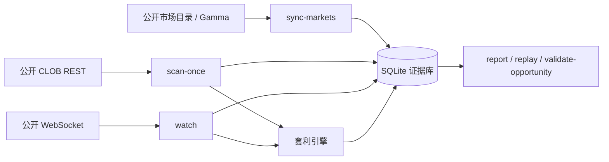

# Prediction-market structural-arbitrage scanner

`predmarket` 是一个面向 Polymarket 的只读结构套利扫描器。
它从公开市场目录、订单簿、费率和 WebSocket 数据里找机会，做二元市场的完整集合、逻辑关系和价格偏离检查，
并把每次判断所依据的证据写入本地 SQLite，方便复盘、回放和后续回测。

这个项目不做的事：

- 不登录、不签名、不持仓；
- 不下单、不交易、不替用户执行任何资产操作；
- 不把“看起来有机会”当成“已经能赚钱”，所有结果都要经过证据和风控门。

## 这页怎么用

这是项目首页，不是完整手册。你可以先按下面顺序看：

1. 先知道它能做什么；
2. 再用最短命令跑起来；
3. 再看系统架构；
4. 最后按目录跳到详细文档。

## 项目能做什么

- 持续同步预测市场目录并入库；
- 通过 `scan-once` 做一次性扫描，找结构套利候选；
- 通过 `watch` 监听公开 WebSocket，发现价格变化后再用 REST 复核；
- 把运行过程、候选结果和证据写进 SQLite，供 `report` / `replay` / `validate-opportunity` 读取；
- 用机器可读 JSON 做自动化处理。

## 最短启动路径

```console
python -m venv .venv
.venv/bin/pip install -e '.[test]'
./bin/doctor
./bin/help
./bin/predmarket --help
```

如果你想马上开始跑主流程，直接看 [最简命令速查表](docs/QUICK-CHEAT-SHEET.md)。

## 运行链路

项目的工作流是：

1. `sync-markets` 同步公开市场目录，入库并去重；
2. `scan-once` 基于已同步的市场和盘口做一次离线扫描；
3. `watch` 监听公开 WebSocket，发现变化后再拉 REST 快照复核；
4. 引擎把候选机会做深度模拟、收益计算和风险判断；
5. SQLite 保存每次运行的证据、候选、状态和统计；
6. `report`、`replay`、`validate-opportunity` 读取同一份 SQLite 证据做分析。

## 系统架构



核心设计点：

- `sync-markets` 把市场目录变成可追踪、可去重、可回放的数据；
- `scan-once` 负责“离线找机会”；
- `watch` 负责“在线发现变化，再复核确认”；
- SQLite 是唯一的本地事实源；
- 所有关键结果都要保留证据链，不能只看 stdout。

## 目录索引

| 文档 | 适合什么时候看 |
|---|---|
| [docs/QUICK-CHEAT-SHEET.md](docs/QUICK-CHEAT-SHEET.md) | 只想复制最短命令 |
| [docs/TUTORIAL.md](docs/TUTORIAL.md) | 第一次从零跑通流程 |
| [docs/PROJECT-GUIDE.md](docs/PROJECT-GUIDE.md) | 想理解项目原理、数据流和代码结构 |
| [docs/OPERATIONS.md](docs/OPERATIONS.md) | 想看运维、恢复、指标和边界 |
| [docs/VERIFICATION.md](docs/VERIFICATION.md) | 想看验证记录和测试结果 |
| [SECURITY.md](SECURITY.md) | 想看安全边界和禁止项 |
| [STRATEGY.md](STRATEGY.md) | 想看策略、规则和风险定义 |

## 重要限制

- 结果只是扫描与验证，不代表真实可成交；
- 盘口会变，延迟会变，部分成交会发生；
- 逻辑关系套利需要人工语义审查；
- `watch` 看到的是触发信号，正式结论仍要经过 REST 复核和风控门；
- SQLite 里的证据优先于终端输出。

## 下一步

- 只想执行：看 [最简命令速查表](docs/QUICK-CHEAT-SHEET.md)
- 想从头学：看 [从零开始教程](docs/TUTORIAL.md)
- 想理解设计：看 [项目说明](docs/PROJECT-GUIDE.md)

