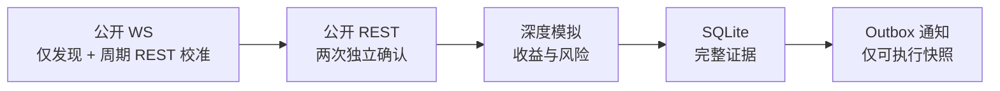
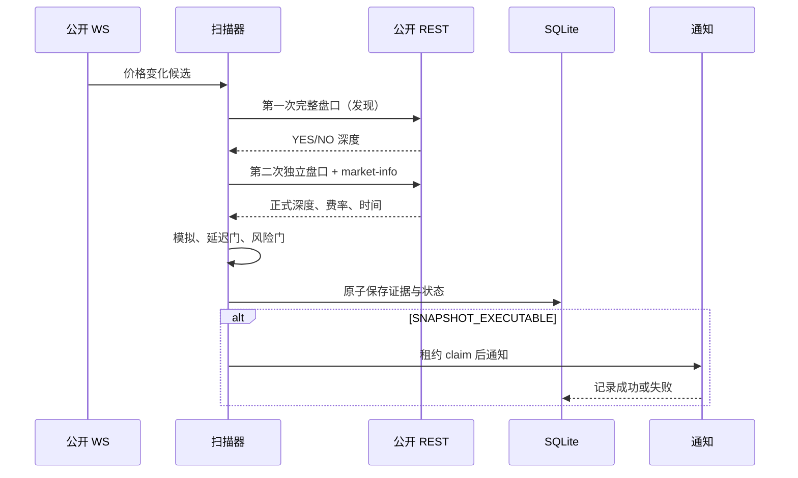

# 结构套利扫描策略

## 定位和硬约束

这是一个**只读研究与证据系统**。它读取 Polymarket 的公开市场目录、盘口、费率和市场频道 WebSocket，不认证、不持有钱包、不签名、不下单。默认研究本金是 `1000`，最低模型净收益率是 `0.0075`，即 **0.75% = 0.0075**。`SNAPSHOT_EXECUTABLE` 只表示两次独立 REST 快照在模型中通过了全部门槛，不保证未来成交，也不是“稳赚”承诺。

计算必须区分：

- **支付成本**：买入代币、费用、转换成本和安全缓冲实际消耗的金额。
- **最低可得收益**：在完整状态集合中能够保证获得的最小支付，或立即转换后实际获得的金额。
- **净利润** = 最低可得收益 − 支付成本。
- **净收益率** = 净利润 ÷ 支付成本。

模型按完整盘口深度逐档计算，不用 `best ask × 数量` 冒充可成交成本。

## 规则

### 规则一：低价二元完整集

同一个经确认的二元市场中，买入同数量的 YES 和 NO，随后有证据支持立即 `MERGE` 或到期赎回。每个终局恰有一个代币支付 1。

```text
最低可得收益 = 数量 × 1
总成本 = YES 全深度买入成本 + NO 全深度买入成本
         + 两腿费用 + 转换成本 + 安全缓冲
通过条件 = 最低可得收益 - 总成本 > 0
           且净收益率 >= 0.0075
```

直观的 `YES + NO < 1` 只是初筛；正式结论必须把费率、转换成本、缓冲和深度全部纳入。

### 规则二：高价二元完整集

可先 `SPLIT` 抵押品得到同数量 YES 和 NO，再分别卖出。扫描器仅在拆分能力、立即转换、结算语义、完整买盘深度、权威费用和转换成本均有证据时评估：

```text
净利润 = 两腿逐档卖出净所得 - 拆分抵押品
         - 转换成本 - 安全缓冲
净收益率 = 净利润 ÷（拆分抵押品 + 转换成本 + 安全缓冲）
```

正式动作证据固定为 `SPLIT → SELL YES → SELL NO`。部分成交风险分别枚举“仅 YES 卖出”和“仅 NO 卖出”：拆分抵押品视为已承诺，成功腿按扣费净所得计，剩余腿只采用证据快照中可立即卖出的保守价值，缺少深度时按零计。最坏损失或未对冲库存超过门槛即拒绝。它仍只是只读快照分类，不能据此声称真实成交。

### 规则三：逻辑蕴含持有路径

若经人工语义审计确认 `A ⇒ B`，允许状态是：

| 状态 | NO_A | YES_B | 合计支付 |
|---|---:|---:|---:|
| A 假，B 假 | 1 | 0 | 1 |
| A 假，B 真 | 1 | 1 | 2 |
| A 真，B 真 | 0 | 1 | 1 |

因此 `NO_A + YES_B` 的最低到期所得为 1；若两腿购买成本、费用、缓冲和持有成本之和低于 1，数学上存在正的最低到期利润。这里的关键是“**最低获得 1**”，而不是“支付 1”。

这条规则依赖跨市场语义、结算标准和持有至到期，当前系统将其保留为 `RESEARCH_ONLY`，不会把它静默解释成即时可执行套利。

### 规则四：NegRisk 完整集

NegRisk 事件可能允许多结果间的转换或完整集关系，但只有在结果集合完整、互斥且穷尽、转换公式与费用逐项建模、代币映射和结算语义均经审计时才可计算。当前实现不满足这些条件，所以 NegRisk 关系只做研究记录。

## 每条规则的风险与控制

| 风险 | 受影响规则 | 可能后果 | 控制与证据 |
|---|---|---|---|
| 两腿不能同时成交 | 全部 | 单腿裸露、利润消失 | 只读系统不下单；部分成交模型估算最坏损失并设置上限；保留两腿完整盘口 |
| 信息迟到、缺失或陈旧 | 全部 | 使用已经失效的价格 | 交易所时间、接收时间、单调时钟、最大书龄、腿间偏斜和处理延迟均为硬门；交易所时间晚于接收时间以 `exchange_after_receive` 拒绝 |
| 队列溢出、断线、重连 | WebSocket 初筛 | 丢增量导致本地盘口错误 | 溢出或序列异常使 epoch 失效；重连后先 REST/完整快照重建；失效 epoch 不接受增量 |
| 费率或 tick 变化 | 规则一、二、NegRisk | 成本低估、订单无效 | 从正式 CLOB market-info 绑定费率曲线；校验 tick 和最小订单量；保存原始响应 |
| 深度和滑点 | 规则一、二 | 顶档机会不可实现 | 逐档行走 L2 深度；缺深度即拒绝；记录数量断点 |
| 部分成交与退出 | 全部 | 产生未对冲损失 | 低估路径按买入腿退出；高估路径按已承诺拆分抵押品、成功卖出腿净所得和剩余币保守清算值逐场景计算；超过门槛即拒绝 |
| 语义与结算 | 逻辑关系、NegRisk | “必有一腿支付”前提错误 | 规则文件必须人工审计、版本化、带来源哈希；未审计或有歧义只做研究 |
| 转换、结算和资金释放 | 全部 | 无法立即合并、资金长期占用 | 区分即时转换与持有到期；转换/结算/释放证据缺失时降级或拒绝 |
| 模型或配置错误 | 全部 | 计算门槛错误 | 金额用 `Decimal`；严格类型/边界测试；保存配置和计算证据；`0.75%=0.0075` 明示 |
| 操作错误 | 全部 | 错配代币、规则或数据库 | 精确 token/condition 绑定；规则冲突不覆盖；退出码和 JSON/标准错误分离 |
| 通知失败或重复 | 可执行快照 | 漏提醒或重复提醒 | SQLite/`report` 轮询是事实来源；通知采用持久单次尝试及崩溃租约回收，不保证送达；租约超时可能重复不确定发送；保存 claim/attempt/event 审计 |

## 简化架构



只有正式 REST 确认结果可以成为 `SNAPSHOT_EXECUTABLE`。WS 本地盘口无论看起来多有利，都只能触发复核。

## 扫描时序



任何数据缺失、时间过旧、两次快照不一致、深度不足、费用不确定、关系未经审计或风险超过限制，都会拒绝或降级为研究候选。
