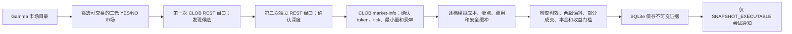

# 项目说明

## 1. 项目是什么

`predmarket` 是一个面向 Polymarket 的**只读结构套利研究扫描器**。它从公开接口读取市场目录、订单簿、费率和 WebSocket 行情，模拟二元市场完整集策略，并把每次判断所依据的数据写入本地 SQLite。

它不会连接钱包、读取账户、签名、下单或撤单。因此，这个项目的产物是“某个时间点的研究判断和可审计证据”，不是自动交易，也不是收益保证。

当前包版本为 `0.2.0`，要求 Python 3.10 或更高版本。

## 2. 它能做什么

项目提供六组命令：

| 命令 | 作用 | 是否联网 | 是否写数据库 |
|---|---|---:|---:|
| `sync-markets` | 从 Gamma 同步公开市场目录 | 是 | 是 |
| `scan-once` | 发现并用两次独立 REST 盘口确认候选 | 是 | 是 |
| `watch` | 用公开 WebSocket 发现价格变化，再用 REST 正式确认 | 是 | 是 |
| `relations validate/import/list` | 校验、导入、查看人工审计的关系规则 | 校验和查看不联网 | 导入写规则文件 |
| `report` | 汇总最近的证据、状态、延迟和通知情况 | 否 | 只读 |
| `replay` | 按机会 ID 或证据 bundle ID 回放完整证据 | 否 | 只读 |

项目当前重点支持同一二元市场的两类完整集研究：

- 低估路径：逐档买入等量 YES 和 NO，研究 `BUY + BUY + MERGE`。
- 高估路径：研究先拆分抵押品，再逐档卖出 YES 和 NO，即 `SPLIT + SELL + SELL`。

跨市场逻辑蕴含和 NegRisk 关系可以被记录和人工审计，但当前不会被静默提升为可执行套利；它们会保持 `RESEARCH_ONLY` 或 `RESEARCH_CANDIDATE`。

## 3. 一次扫描如何工作



`watch` 中的 WebSocket 只负责触发候选检查。本地 WebSocket 订单簿即使看起来有利润，也不能直接产生正式结论；回调仍要重新取得两次独立 REST 快照和权威费率。

## 4. 结果状态怎么理解

| 状态 | 含义 | 操作建议 |
|---|---|---|
| `REJECTED` | 某个必要门槛失败，例如没有候选、数据过旧、深度不足或收益不足 | 查看 `reason`、`risk_reasons` 和 `stage` |
| `RESEARCH_CANDIDATE` | 数学关系值得研究，但转换、结算、释放时间或语义证据不足 | 继续人工研究，不把它当作可执行机会 |
| `SNAPSHOT_EXECUTABLE` | 捕获到的 REST 快照在当前模型和配置下通过全部门槛 | 只表示历史快照通过，不保证随后能成交 |

常见 `reason`：

- `no_candidate`：第一轮盘口没有发现低估或高估结构。
- `return_below_minimum`：扣除费用、缓冲等成本后，收益率低于配置门槛。
- `no_feasible_quantity`：在深度、本金或最小订单量约束下没有可行数量。
- `invalid_fee_binding`：无法把权威费率完整绑定到 condition 和两个 token。
- `market_not_tradeable` / `invalid_relation`：目录或关系规则未通过。
- `stale`、`leg_skew`、`processing_latency`、`exchange_after_receive`：时间或数据因果关系不合法。
- `release_date_unknown`、`settlement_unresolved` 等：风险证据不足，通常只保留为研究候选。

最终判断应以 `report` 和 `replay` 中保存的 SQLite 证据为准，而不是终端通知。

## 5. 配置模型

默认配置是 `config/default.yaml`：

| 字段 | 默认值 | 说明 |
|---|---:|---|
| `bankroll` | `"1000"` | 单次模型允许使用的研究本金上限 |
| `minimum_return` | `"0.0075"` | 最低净收益率；`0.0075` 表示 0.75% |
| `safety_buffer_rate` | `"0.0025"` | 为价格变化等不确定性预留的成本缓冲 |
| `max_leg_failure_loss` | `"5"` | 单腿失败情景允许的最大模型损失 |
| `max_unhedged_notional` | `"20"` | 允许的最大未对冲名义金额 |
| `default_simulation_quantity` | `"10"` | 默认模拟数量 |
| `conversion_cost` | `"0"` | MERGE/SPLIT 等转换的额外模型成本 |
| `maximum_book_age_ms` | `1000` | 盘口最大年龄 |
| `maximum_leg_skew_ms` | `250` | 两腿交易所时间最大偏差 |
| `maximum_processing_latency_ms` | `100` | 接收后允许的最大处理延迟 |
| `reconcile_interval_seconds` | `30` | WebSocket 本地状态的 REST 校准周期 |
| `queue_capacity` | `10000` | WebSocket 事件队列容量 |
| `database_path` | `data/predmarket.sqlite3` | SQLite 证据库路径 |

所有金额和比率必须写成 YAML 字符串，整数时间和容量必须写成正整数。建议复制默认配置后通过 `--config` 使用，不要直接修改默认文件：

```console
cp config/default.yaml config/local.yaml
./bin/predmarket --config config/local.yaml report
```

全局选项 `--config` 和 `--json` 必须写在子命令前。

## 6. 代码结构

| 路径 | 职责 |
|---|---|
| `predmarket/cli.py` | 参数解析、JSON 输出和退出码 |
| `predmarket/commands.py` | 六组命令的编排和依赖组装 |
| `predmarket/engine.py` | 两轮确认、模拟、风险分类、证据保存和通知 |
| `predmarket/simulator.py` | 按完整订单簿深度模拟动作路径和数量 |
| `predmarket/risk.py` | 收益、部分成交、未对冲和结算风险门 |
| `predmarket/latency.py` | 盘口年龄、腿间偏斜和处理延迟校验 |
| `predmarket/storage.py` | SQLite schema、迁移、证据、目录、通知和报告 |
| `predmarket/relations.py` | 人工审计关系规则的解析与验证 |
| `predmarket/polymarket/gamma.py` | 公开 Gamma 市场目录 |
| `predmarket/polymarket/clob.py` | 公开 CLOB 盘口、费率和市场信息 |
| `predmarket/polymarket/ws.py` | 公开市场 WebSocket、epoch、队列和重连 |
| `config/default.yaml` | 默认风险和运行配置 |
| `rules/` | 已导入或示例关系规则 |
| `tests/unit/`、`tests/integration/` | 单元、命令编排和只读安全边界测试 |

## 7. 数据与证据

默认数据库会在首次需要时创建。核心数据包括：

- 版本化市场目录快照和当前市场状态；
- 每次机会判断的运行、盘口、费率、动作、成本、风险和延迟证据；
- 研究关系观察；
- WebSocket 运行指标；
- 通知 claim、尝试和事件审计。

同一个 `opportunity_id` 可以有多次评估。`replay OPPORTUNITY_ID` 选择该机会最新的一次评估；`replay --bundle-id BUNDLE_ID` 精确选择某一份不可变证据。

SQLite 使用 WAL。备份和恢复不要只复制主数据库文件，具体流程见 [运维手册](OPERATIONS.md)。

## 8. 网络与安全边界

程序只访问以下公开接口：

- `GET https://gamma-api.polymarket.com/markets/keyset`
- `POST https://clob.polymarket.com/books`
- `GET https://clob.polymarket.com/fee-rate`
- `GET https://clob.polymarket.com/clob-markets/{condition_id}`
- `WSS wss://ws-subscriptions-clob.polymarket.com/ws/market`

HTTP 客户端不信任代理环境，也拒绝认证、cookie、API key 和签名头。完整威胁模型见 [SECURITY.md](../SECURITY.md)。

## 9. 已知限制

- 不下单，因此无法验证真实队列位置、两腿同时成交或实际结算。
- `SNAPSHOT_EXECUTABLE` 只对保存的瞬时快照成立。
- 逻辑关系需要人工语义审计，且当前只作为研究记录。
- 桌面通知不保证送达，租约恢复时还可能产生可审计的重复提醒。
- 仓库没有声称已完成 24 小时 soak 或 7 天连续观察。
- 默认阈值是研究参数，不是投资建议。

实际操作请继续阅读 [从零开始教程](TUTORIAL.md)；策略公式见 [STRATEGY.md](../STRATEGY.md)，生产运行和故障处理见 [运维手册](OPERATIONS.md)。
