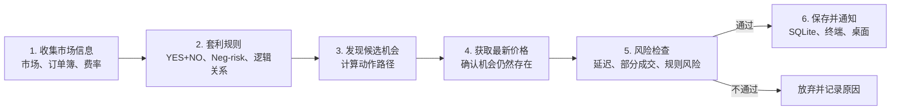

# Polymarket 结构套利扫描器设计

日期：2026-07-26
状态：已根据用户审查意见修订，等待最终确认
阶段：三个盈利能力周期中的第一周期

## 1. 目标

构建一个 Python 事件驱动、模块化的只读系统，检测并仿真 Polymarket 内部结构套利。
系统同时提供单次扫描和持续监听，以真实订单簿深度、市场实时费率、最小订单量、
价格精度和现实执行风险计算机会。

第一阶段模拟本金为 1,000 美元。只有在扣除手续费、价格冲击、转换成本和 0.25%
安全缓冲后，最低净收益率仍不低于 0.75% 的组合才报警。不另设最低绝对利润。

本阶段不读取私钥、不调用认证交易接口、不提交真实订单。验收不要求市场必须出现机会。

## 2. 核心原理

系统寻找从 pUSD 出发，经过一组现实允许的动作，最终在即时转换或所有允许结算状态下，
保守地获得更多 pUSD 的路径：

```text
初始 pUSD
  → BUY / SELL / SPLIT / MERGE / NEG_RISK_CONVERT / REDEEM
  → 最低获得金额大于总投入
```

系统使用以下固定术语：

- **总投入**：建立并完成组合需要花出的全部资金；
- **最低获得金额**：所有允许结果中，组合最少能够获得的 pUSD；
- **最低净利润**：最低获得金额减去总投入；
- **最低净收益率**：最低净利润除以最大资金占用；
- **快照可执行机会**：在指定订单簿快照中满足全部数学和风险门槛的机会。

系统不得使用含义不清的“支付”描述用户获得的资金，也不得把快照可执行机会称为
“绝对稳赚”或“无执行风险套利”。

## 3. 范围

### 3.1 包含

- 二元低估：买入 YES 和 NO 后 merge；
- 二元高估：split 后卖出 YES 和 NO；
- Neg-risk 多结果事件的完整集合与官方允许的转换路径；
- 人工审核的蕴含、互斥和等价市场关系；
- `scan-once` REST 快照扫描；
- `watch` WebSocket 持续监听；
- SQLite 审计、离线重放、终端报警和 macOS 桌面通知；
- 为未来 Kalshi 数据适配器预留标准化接口，但不实现 Kalshi 集成。

### 3.2 不包含

- 概率预测模型；
- 做市或奖励优化；
- 自动语义关系直接进入生产；
- 裸卖空或假定已有头寸；
- 密钥管理、认证、真实 split/merge、下单、撤单或真实资金；
- Web 控制台、云部署或多节点服务；
- 非单位权重的通用线性规划套利。

第一版逻辑关系只允许单位权重组合：每条交易腿份数均为 `q`。无法用单位权重表达的规则
必须被校验器拒绝，后续只有在真实数据证明有需求时才引入优化求解器。

## 4. 简化架构



核心数据流为：

```text
收集最新价格
  → 套用人工确认的规则
  → 发现可能有利润的动作路径
  → 用最新完整订单簿和费率二次确认
  → 检查部分成交、信息延迟和规则风险
  → 最低净收益率不低于 0.75%
  → 保存完整证据并通知
```

## 5. 组件

### 5.1 `MarketCatalog`

使用 Gamma API 的 keyset/游标分页同步活跃事件、二元市场和 outcome token，保存：

- event、market、condition 和 token 标识；
- YES/NO outcome、结算时间和市场状态；
- CLOB 可用性、`negRisk`、tick size 和费用状态；
- 原始结算规则、规则来源和内容 hash。

Polymarket 的基础 market 是二元 YES/NO。多结果事件建模为多个关联二元市场以及相应的
Neg-risk 转换规则，不能建模为单个普通多 outcome token 市场。

关闭或结算的市场只更新状态，不删除历史记录。

### 5.2 `OrderBookGateway`

数据接收和计算必须分离：

- `scan-once` 通过批量 `POST /books` 获取完整订单簿；
- `watch` 通过公开 market WebSocket 接收 `book`、`price_change`、
  `tick_size_change` 和市场生命周期事件；
- WebSocket 接收任务只解析信封、记录接收时间并写入有界队列；
- 订单簿更新、套利计算和 SQLite 写入不得阻塞 WebSocket 接收；
- 队列溢出不得静默丢消息，必须使相关订单簿失效。

每条数据记录四个时间：

- `exchange_ts`：交易所生成消息的时间；
- `received_ts`：本机收到消息的墙上时间；
- `received_monotonic`：本机收到消息的单调时钟时间；
- `evaluated_monotonic`：完成套利计算的单调时钟时间。

由此计算网络表观延迟、本地处理延迟和端到端表观延迟。

### 5.3 `OrderBookEpochManager`

每个本地订单簿属于一个明确 epoch，状态为：

```text
WARMING → LIVE → STALE / RESYNC
```

WebSocket 建立或恢复时：

1. 把相关订单簿标记为 `WARMING`；
2. 等待完整 `book` 或取得完整 REST 快照；
3. 原子替换本地订单簿；
4. 校验市场状态、tick size 和时间；
5. 切换到 `LIVE` 后才允许计算。

断线、时间倒退、队列溢出、未知消息、状态冲突或无法证明连续性时，epoch 立即失效。
系统不得把无法证明连续的增量应用到旧订单簿。

每 30 秒进行 REST 抽样校验。该校验用于完整性检查，不代表数据具有 30 秒有效期。

### 5.4 `RelationRegistry`

关系集合定义：

- 所有可能且互斥的世界状态；
- 每个 token 在各状态下的 0/1 结算获得金额；
- 允许的动作和单位权重交易腿；
- 哪些状态被结算规则允许；
- 规则来源快照/hash、审核人、审核时间、版本和有效期。

验证分为两类：

1. **机器结构校验**：字段、矩阵维度、状态互斥、token 存在性和单位权重；
2. **人工语义认证**：自然语言规则是否真的排除某些现实状态。

机器校验不得声称能够证明自然语言规则在现实语义上完备。系统可生成待审核候选，但只有
状态为 `active`、结构校验通过并完成人工语义认证的规则可用于正式机会。

### 5.5 `ActionPathPlanner`

系统支持以下仿真动作：

```text
BUY
SELL
SPLIT
MERGE
NEG_RISK_CONVERT
REDEEM
```

动作规划器只使用市场元数据明确允许的路径。例如：

- 买入等量 YES 和 NO 后 merge 为 pUSD；
- 用 pUSD split 出等量 YES 和 NO 后卖入 bid；
- 按 Neg-risk 官方转换规则处理关联二元市场；
- 对不能即时转换的逻辑组合，持有至相关市场全部结算。

动作规划器必须区分：

- `IMMEDIATE_CONVERSION`：可以通过 split、merge 或 conversion 快速闭环；
- `HOLD_TO_RESOLUTION`：必须等待一个或多个市场结算。

### 5.6 `ExecutionSimulator`

给定动作路径和一致性订单簿：

- BUY 按 ask 从低到高逐档消耗；
- SELL 按 bid 从高到低逐档消耗；
- 所有单位权重交易腿使用同一份数 `q`；
- 使用每个 token 的完整实时 fee schedule；
- 应用 tick size、数量精度和最小订单量；
- 计入 split、merge、conversion 和 Relayer 的保守成本；
- 对订单簿交易成本应用 0.25% 安全缓冲；
- 限制最大资金占用不超过 1,000 美元；
- 遍历订单簿深度变化点；
- 输出最大可成交数量、最大最低净利润数量和最大最低净收益率数量。

每条机会必须保存 fee rate、exponent、适用方向、获取时间和来源。费率参数变化后，使用旧
fee schedule 计算的未确认机会立即失效。

### 5.7 `RiskEngine`

数学上有利润只是候选机会。风险引擎必须逐项检查：

- 数据和延迟风险；
- 部分成交与追价风险；
- split、merge 或 conversion 失败风险；
- 人工逻辑关系例外；
- 结算延期、争议与资金占用；
- 1,000 美元本金限制和最大裸露头寸。

每个机会都输出机器可读风险结果和拒绝原因。

风险判定产生三个明确状态：

- `REJECTED`：数学门槛、数据有效性或硬风险门槛未通过；
- `RESEARCH_CANDIDATE`：数学成立，但存在尚未量化或需要人工复核的风险；
- `SNAPSHOT_EXECUTABLE`：数学、数据和已定义的硬风险门槛全部通过。

只有 `SNAPSHOT_EXECUTABLE` 才发送桌面通知。其他状态只写入 SQLite 和报告。

### 5.8 `OpportunityStore`

SQLite 使用 WAL 模式，至少包含：

- `events`
- `markets`
- `tokens`
- `fee_schedules`
- `relation_sets`
- `relation_states`
- `relation_payoffs`
- `book_epochs`
- `orderbook_snapshots`
- `orderbook_levels`
- `opportunities`
- `opportunity_legs`
- `opportunity_actions`
- `risk_assessments`
- `runs`
- `latency_metrics`
- `notifications`

机会和证据包必须在单一事务内保存。证据包含关系版本、引擎版本、fee schedule、
完整订单簿深度、动作路径、时间戳、延迟、成本拆分、最低获得金额、最低净利润、
最低净收益率以及最坏部分成交损失。

### 5.9 `Notifier`

- 终端输出高亮的人类可读摘要；
- `scan-once` 同时支持机器可读 JSON；
- SQLite 成功保存证据后才发送通知；
- macOS 桌面通知失败只写日志，不得中断扫描；
- 相同关系、动作路径、订单簿 hash 和经济结果的机会去重；
- 只有收益率、可成交数量或订单簿 hash 实质变化时才重复通知。

## 6. 套利规则

### 6.1 二元低估

买入同一市场的 YES 和 NO，然后 merge：

```text
YES ask 买入成本
+ NO ask 买入成本
+ 两腿手续费
+ 安全缓冲
+ merge 保守成本
< merge 后获得的 pUSD
```

### 6.2 二元高估

先 split，再将 YES 和 NO 卖入 bid：

```text
YES bid 卖出所得
+ NO bid 卖出所得
- 两腿手续费
- 安全缓冲
- split 保守成本
> split 占用的 pUSD
```

这不是裸卖空，因为系统先仿真 split 获得 token，再仿真卖出。

### 6.3 Neg-risk 完整集合

多结果事件由多个关联二元市场组成。系统只能使用市场元数据和人工认证规则中明确允许的
Neg-risk conversion 路径。不能仅凭标题相似或简单把多个 YES 价格相加就认定套利。

### 6.4 逻辑关系

例如人工认证 `A ⇒ B`，状态 `A=YES, B=NO` 被规则排除。组合：

```text
NO_A + YES_B
```

在所有允许状态下最少获得 1 pUSD。因此：

```text
NO_A 买入成本
+ YES_B 买入成本
+ 全部费用和缓冲
< 1 pUSD
```

时存在持有至结算的候选机会。

该规则必须明确检查独立参选、候选人替换、截止时间、结算来源和自然语言定义等例外。

## 7. 收益计算

### 7.1 即时转换路径

对于 merge、split 或 Neg-risk conversion 路径：

```text
总投入
  = 订单簿逐档成本
  + 交易费
  + 转换保守成本
  + 安全缓冲

最低净利润
  = 转换完成后获得的 pUSD
  - 总投入

最低净收益率
  = 最低净利润
  / 最大资金占用
```

### 7.2 持有至结算路径

设有效状态集合为 \(S\)，token 集合为 \(T\)，每条腿份数为 \(q\)，token \(t\) 在状态
\(s\) 下的结算获得金额为 \(P_{t,s}\in\{0,1\}\)：

\[
G(q) = \min_{s \in S}\sum_{t \in T}qP_{t,s}
\]

其中 \(G(q)\) 是最低获得金额。设订单簿成本为 \(C(q)\)，交易和转换费用为 \(F(q)\)，
安全缓冲为：

\[
B(q)=0.0025\times C(q)
\]

则：

\[
I(q)=C(q)+F(q)+B(q)
\]

\[
\text{MinimumProfit}(q)=G(q)-I(q)
\]

\[
\text{MinimumReturn}(q)=\frac{\text{MinimumProfit}(q)}{\text{MaximumCapitalUsed}(q)}
\]

持有至结算机会还必须输出预计最晚资金释放日期、持有天数和最低年化收益率。
0.75% 是所有机会的基础门槛，不代表长期锁仓机会自动值得执行。

## 8. 风险规则

### 8.1 通用风险输出

每个候选机会必须输出：

```text
data_risk
fill_risk
conversion_risk
rule_risk
settlement_risk
capital_lock_risk
atomic_execution
max_unhedged_exposure
immediate_unwind_value
worst_leg_failure_loss
maximum_safe_quantity
maximum_second_leg_price
recommended_leg_order
```

### 8.2 逐规则风险

| 规则 | 必须检查的主要风险 |
|---|---|
| 买 YES + NO 后 merge | 两腿不能同时成交、立即平仓损失、merge 暂不可用 |
| split 后卖 YES + NO | 一腿卖不掉、剩余 token 库存、split/Relayer 延迟 |
| Neg-risk 转换 | 结果集合不完备、转换规则错误、conversion 暂不可用 |
| 逻辑关系 | 蕴含关系例外、结算定义不同、截止时间不一致 |
| 持有至结算 | 资金长期锁定、争议或延期、提前退出深度不足 |

### 8.3 部分成交压力测试

所有可能的单腿成交顺序都要仿真：

- 只有第一腿成交；
- 只有第二腿成交；
- 任一腿部分成交；
- 下一腿价格移动到允许追价上限；
- 立即用 bid/ask 平仓；
- 平仓订单簿深度不足；
- 网络中断后留下未对冲头寸。

理论利润不能抵消未披露的执行风险。即使最低净收益率达到 0.75%，只要关键风险数据缺失，
机会仍必须被拒绝。

第一阶段使用以下硬门槛：

- 最坏单腿失败损失不超过本金的 0.5%，即 5 美元；
- 最大未对冲名义金额不超过本金的 2%，即 20 美元；
- 不能从当前 bid/ask 深度计算立即平仓价值时，状态只能是 `RESEARCH_CANDIDATE`；
- `HOLD_TO_RESOLUTION` 缺少人工确认的最晚资金释放日期时，状态只能是
  `RESEARCH_CANDIDATE`；
- 任一关系风险、转换风险或结算风险被标记为未解决时，状态不能是
  `SNAPSHOT_EXECUTABLE`。

这些门槛是 1,000 美元验证本金的风险上限，不是建议使用完的目标额度。

## 9. 信息时效与二次确认

正式机会必须同时满足：

- 订单簿数据年龄不超过 1 秒；
- 各腿 `exchange_ts` 偏差不超过 250 毫秒；
- 从本机接收到完成计算不超过 100 毫秒；
- 相关订单簿均属于同一个有效逻辑确认批次；
- 所有订单簿 epoch 均为 `LIVE`；
- 消息队列没有溢出；
- 市场、tick size 和 fee schedule 均有效。

100 毫秒是初始工程预算，必须根据实时运行的 p95/p99 结果评估，不能假定系统天然达到。

`watch` 使用两阶段确认：

1. WebSocket 快速发现候选；
2. 批量 REST 重新获取涉及的完整订单簿和 fee schedule；
3. 使用确认快照重新计算；
4. 只有仍满足 0.75% 及全部风险门槛时才记录正式机会。

REST 二次确认会增加延迟，但第一阶段目标是验证信号真实性和测量机会寿命。二次确认后消失
的候选必须记录为 `expired_before_confirmation`，用于评估未来实盘执行是否现实。

## 10. 数据流

### 10.1 `sync-markets`

1. 分页读取活跃事件和二元市场。
2. 标准化并写入市场、token、Neg-risk 和费用元数据。
3. 更新已有市场生命周期状态。
4. 生成待审核结构关系候选。
5. 保存结算规则快照和 hash。

### 10.2 `scan-once`

1. 读取所有有效规则及涉及 token。
2. 分批获取完整订单簿和 fee schedule。
3. 分配确认批次 ID 和四类时间戳。
4. 运行动作规划、执行仿真和风险判定。
5. 原子保存有效机会及接近门槛的诊断。
6. 输出 JSON 和摘要，并在需要时发送桌面通知。

### 10.3 `watch`

1. 建立新的订单簿 epoch。
2. WebSocket 接收任务持续写入有界队列。
3. 订单簿任务应用增量并维护有效状态。
4. 只重新计算受影响的关系。
5. 候选机会通过 REST 二次确认。
6. 保存机会、拒绝原因、延迟和运行指标。
7. 失效时停止相关计算并重建 epoch。

## 11. CLI

```text
predmarket sync-markets
predmarket scan-once
predmarket watch
predmarket relations list
predmarket relations validate
predmarket relations import <yaml-path>
predmarket replay <opportunity-id>
predmarket report
```

规则导入是原子的。任一机器结构校验错误都会拒绝整个文件。人工语义认证字段缺失的规则
只能以 `pending` 状态导入，不能激活。

`replay` 不访问网络，必须从保存的规则版本、fee schedule、订单簿和动作路径得到相同结果。

## 12. 故障处理

以下情况使受影响关系进入 `data_invalid`，不运行正式套利判定：

- WebSocket 断线、未知消息或无法证明增量连续；
- 有界队列溢出；
- 时间戳倒退、跨腿时间偏差超限或数据过期；
- 本地处理延迟超过预算；
- 缺少任一交易腿、fee schedule 或最小订单量；
- 市场状态、tick size、Neg-risk 或结算规则发生变化；
- `Decimal` 转换、精度或舍入失败；
- SQLite 事务失败；
- 检测到明显系统时钟跳变。

网络重连使用带随机抖动的指数退避。重连成功不代表数据有效，必须完成订单簿 epoch 重建。
通知失败只记录错误，不改变机会判定结果。

## 13. 测试策略

实现严格遵循 RED–GREEN–REFACTOR：先写失败测试并观察失败，再写最小实现，通过后重构。

### 13.1 单元和性质测试

- BUY/SELL 逐档成交与数量断点；
- split、merge、Neg-risk conversion 动作路径；
- 动态 fee schedule、安全缓冲和资金上限；
- 状态矩阵、最低获得金额和单位权重限制；
- ask 上升不能提高买入套利利润；
- bid 下降不能提高卖出套利利润；
- 深度减少不能提高最大成交量；
- 费用增加不能创造机会；
- 任一有效状态获得金额不足时不得报警。

### 13.2 风险测试

- 所有单腿和部分成交排列；
- 立即平仓深度不足；
- 第二腿价格跳变；
- 处理延迟、跨腿时间偏差和队列溢出；
- epoch 失效期间不得产生正式机会；
- 规则过期或 fee schedule 变化后机会立即失效。

### 13.3 契约和集成测试

- 使用冻结的官方 REST/WebSocket 样例；
- 未知结构必须显式失败；
- 本地假服务器模拟快照、增量、乱序、断线、重连和限流；
- 模拟 REST 二次确认后机会存在和消失；
- 测试不依赖生产网络。

### 13.4 回放测试

- 机会可离线确定性重算；
- 数据库迁移前后的历史机会仍可重放；
- 引擎版本变化时保留原版本输出，不静默覆盖。

## 14. 验收

- 固定样例、风险测试和历史回放全部通过；
- 连续运行 24 小时无崩溃；
- 断线、队列溢出和乱序后可自动重建；
- 每条正式机会保存完整订单簿、fee schedule、动作路径和风险结果；
- 实时观察至少 7 天；
- 正式机会最低净收益率不低于 0.75%；
- 系统报告运行时间、数据缺口、重连次数、epoch 失效次数、陈旧订单簿数、
  队列高水位、扫描关系数、候选数、二次确认后消失数、正式机会数、最低净利润、
  最坏单腿失败风险，以及网络、本地和端到端延迟的 p50/p95/p99。

七天内未发现机会是合格的测量结果，不允许降低门槛或制造信号来满足数量指标。

## 15. 官方接口依据

- 市场发现：`https://gamma-api.polymarket.com`
- CLOB：`https://clob.polymarket.com`
- WebSocket：`wss://ws-subscriptions-clob.polymarket.com/ws/market`
- 官方订单簿文档：<https://docs.polymarket.com/trading/orderbook>
- 官方 WebSocket 文档：<https://docs.polymarket.com/market-data/websocket/market-channel>
- 官方费用文档：<https://docs.polymarket.com/trading/fees>
- 官方 CTF 文档：<https://docs.polymarket.com/trading/ctf/overview>
- 官方持仓与 token 文档：<https://docs.polymarket.com/concepts/positions-tokens>
- 官方速率限制：<https://docs.polymarket.com/api-reference/rate-limits>
