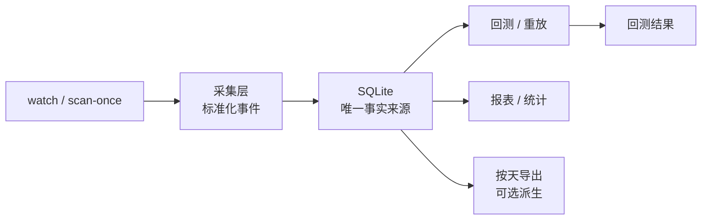

# SQLite 监控与回测采集设计

日期：2026-07-26
状态：待用户审查
阶段：持续采集与离线回测数据底座

## 1. 目标

构建一个以 SQLite 为唯一事实来源的数据底座，用于持续采集线上监控数据，并支持回测直接从 SQLite 读取历史事实。

本阶段不引入独立按天数据文件作为主路径，不要求另建消息队列或单独采集服务。按天导出可以作为后续派生产物，但不是本设计的核心依赖。

目标是让系统可以稳定记录：

- 线上 `watch` 运行过程中的连接、重连、WS 指标、REST 复核结果和命中机会；
- `scan-once` 产生的快照扫描结果；
- 回测所需的原始事实、机会证据和运行元数据；
- 可复现的历史读取入口，使回测直接读取 SQLite 即可。

## 2. 核心原则

1. SQLite 是唯一事实来源。所有后续分析、回放、报表和回测都以数据库中的记录为准。
2. 采集层只记录事实，不做二次推断。它可以附带标准化字段，但不替代分析层。
3. 回测必须能直接读取 SQLite，不依赖导出文件。
4. 线上采集与离线读取共享同一套字段定义、同一套时间字段、同一套机会标识。
5. 采集结果必须可幂等写入，重复运行不会制造逻辑重复记录。

## 3. 范围

### 3.1 包含

- `watch` 运行过程的持续采集；
- `scan-once` 的扫描结果采集；
- 机会、证据、WS 指标、连接元数据和 REST 复核结果落库；
- SQLite 直读回测接口；
- 按天导出作为可选派生能力的接口预留；
- 针对采集和回测的幂等、失败恢复和重放测试。

### 3.2 不包含

- 真实下单或交易执行；
- 多节点分布式采集；
- 独立消息总线；
- 强制按天导出文件作为回测主输入；
- 云端托管、权限管理或前端控制台；
- 对外发布公共数据 API。

## 4. 设计选择

本设计采用方案 1：

- 采集事件持续写入 SQLite；
- 回测直接从 SQLite 查询和重放；
- 按天导出只作为后续可选功能，不作为当前实现前提。

这样可以避免“双存储双真相”，并保持线上与回测使用同一份事实数据。

## 5. 数据流

核心流程：

1. `watch` 或 `scan-once` 产生原始事件；
2. 采集层把事件标准化成统一记录；
3. 记录写入 SQLite；
4. 回测直接从 SQLite 按时间、条件、机会或运行 ID 读取；
5. 如需要归档，按天导出从 SQLite 派生生成。

## 6. 数据模型

### 6.1 统一时间字段

所有采集记录尽量保留以下时间：

- `exchange_ts_ms`：交易所或数据源时间；
- `received_wall_ms`：本机收到时间；
- `received_monotonic`：本机单调时钟收到时间；
- `evaluated_monotonic`：本机完成评估时间；
- `persisted_at_ms`：写入 SQLite 的墙上时间。

并非所有表都需要完整字段，但凡是与延迟、回放或排序相关的记录，都应保留可追踪时间。

### 6.2 建议新增或扩展的表

本设计不要求立即推翻现有 schema，而是建议在现有 `storage.py` 结构上扩展以下概念表：

- `watch_runs`
  - 一次 `watch` 命令的运行元数据；
  - 包含开始/结束时间、参数摘要、是否成功、退出原因。

- `watch_events`
  - 线上 `watch` 过程中处理过的标准化事件；
  - 包括事件类型、token、condition、原始 JSON、解析后的 canonical JSON、时间字段、是否触发机会。

- `watch_metrics`
  - 每次运行结束时的指标快照；
  - 包括 received、dropped、malformed、heartbeats、disconnects、reconnects、resyncs、overflows、callback_failures、latency 摘要等。

- `scan_runs`
  - 一次 `scan-once` 扫描运行的元数据；
  - 包括参数、来源、条目数、成功/失败状态。

- `scan_candidates`
  - 扫描发现的候选机会；
  - 包括原始依据、标准化规则 ID、条件 ID、token 集、风险结论和排序信息。

- `replay_queries`
  - 回测或重放的查询条件；
  - 记录输入范围和输出摘要，便于复现与审计。

现有的机会、证据、通知和重放相关表可继续复用，不要求复制一套新体系。

## 7. 线上采集设计

### 7.1 `watch` 持续采集

`watch` 运行时除了当前已有的扫描和确认逻辑，还需要把以下事实持续写库：

- 每次连接建立和关闭；
- 每次重连；
- 每个被接受或被丢弃的事件摘要；
- 每次 REST 复核的结果；
- 每个最终进入候选/机会路径的标准化证据；
- 每次运行结束的指标快照。

采集层不应阻塞 WebSocket 接收或核心套利判断。如果数据库短暂失败，采集失败必须可见，但不能让接收线程悄悄堆积未处理消息。

### 7.2 `scan-once` 持续采集

`scan-once` 在扫描完成后，把以下内容写入 SQLite：

- 本次扫描参数；
- 扫描到的完整市场集合摘要；
- 每个被评估市场的结果；
- 若发现机会，则保存标准化证据和风险结果。

这使得单次扫描结果可以作为后续回测和审计的输入。

## 8. 回测直读设计

回测不依赖按天导出文件，而是直接从 SQLite 读取历史记录。

### 8.1 回测输入

回测可以基于以下任一维度读取：

- 时间窗口；
- 条件 ID；
- token ID；
- 机会 ID；
- 运行 ID；
- 风险状态；
- 具体规则版本。

### 8.2 回测输出

回测至少应返回：

- 命中记录；
- 机会状态；
- 原始证据；
- 风险结论；
- 相关延迟指标；
- 可复现的查询参数。

### 8.3 回测语义

回测只读 SQLite，不回连线上 API，不重新推导历史真相。它可以重算派生指标，但不能覆盖或改写历史事实。

## 9. 按天导出

按天导出在本阶段为可选功能，主要用于归档、搬运和人工检查，不作为回测主路径。

如果后续启用，导出内容应来自 SQLite 的稳定查询结果，建议至少包含：

- 当天运行元数据；
- 当天事件和候选摘要；
- 当天机会证据；
- 当天指标快照；
- 当天回测查询记录。

导出格式可先采用 JSONL 或压缩 JSON 包，不要求一开始就支持复杂列式格式。

## 10. 错误处理与幂等

### 10.1 幂等写入

同一条采集记录在重复导入时必须能通过稳定主键或内容哈希去重。

### 10.2 部分失败

如果某次 `watch` 或 `scan-once` 过程中部分记录写库失败：

- 失败必须写入运行元数据；
- 已写入的记录不回滚为默认假设；
- 后续重放可以识别运行是否完整。

### 10.3 重放稳定性

回测读取同一组 SQLite 记录时，必须得到稳定输出。只要底层数据库不变，结果必须可重复。

## 11. CLI 影响

### 11.1 现有命令

现有 `sync-markets`、`scan-once`、`watch`、`replay`、`report` 继续保留。

### 11.2 建议新增命令

如果实现复杂度可控，建议补一个最小的回测入口：

- `backtest`
  - 直接从 SQLite 读取历史事实；
  - 支持时间窗口、条件 ID、规则 ID 或机会 ID；
  - 输出可读摘要和机器可读 JSON。

如果暂时不加新命令，也可以先把回测能力挂到现有 `replay` 或 `report` 上，但要保证接口语义清晰。

## 12. 验收标准

以下条件应视为设计完成的最低验收：

- `watch` 的运行事实可以持续写入 SQLite；
- `scan-once` 的扫描事实可以持续写入 SQLite；
- 回测可以只依赖 SQLite 完成读取和重放；
- 数据库中可以按运行、按时间和按机会查询历史事实；
- 写库失败或运行中断后，历史记录仍然可审计；
- 新增测试可以验证幂等、查询、回放和基本失败恢复。

## 13. 测试要求

必须补的测试包括：

- SQLite 采集记录的幂等写入测试；
- `watch` 运行元数据和指标持久化测试；
- `scan-once` 结果持久化测试；
- SQLite 直读回测测试；
- 部分失败后的可审计性测试；
- 按天导出接口的占位测试，如果该接口在本阶段实现。

## 14. 预期风险

- 如果把回测和线上采集混在同一条写路径，可能引入锁竞争；
- 如果历史记录字段不统一，后续回放会出现语义漂移；
- 如果导出文件被过早当成主路径，会重新引入双真相问题；
- 如果运行元数据记录不全，后续很难定位采集缺口。

## 15. 后续推进顺序

1. 先扩展 SQLite schema 与存储接口；
2. 再把 `watch` 运行元数据和事件持续写入；
3. 再把 `scan-once` 的结果写入；
4. 再实现回测直读；
5. 最后视需要增加按天导出。

