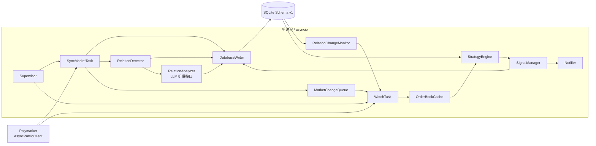
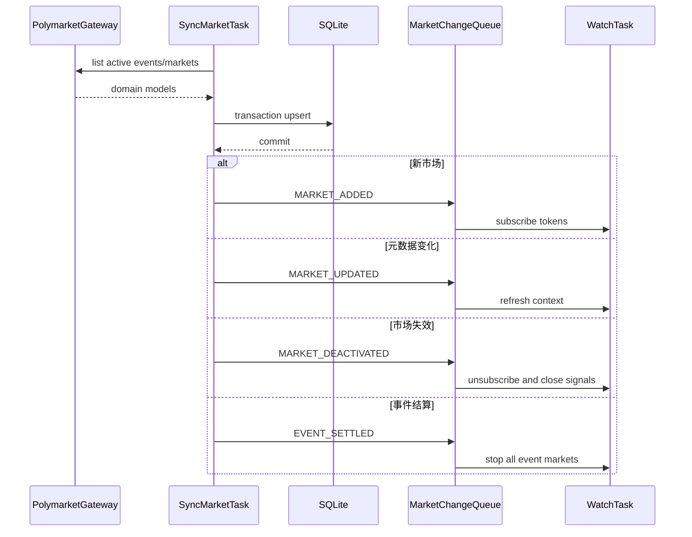
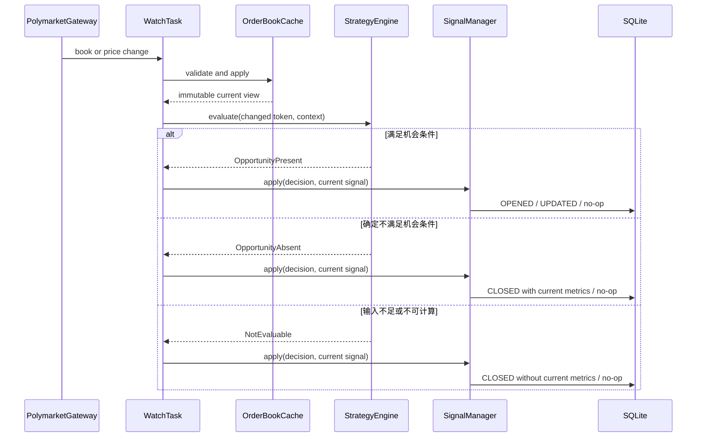
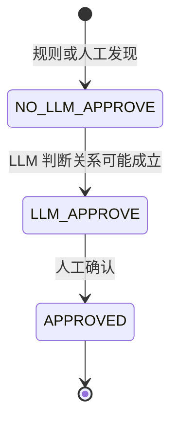
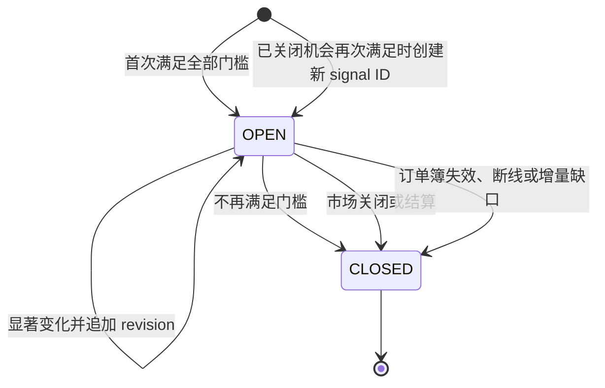
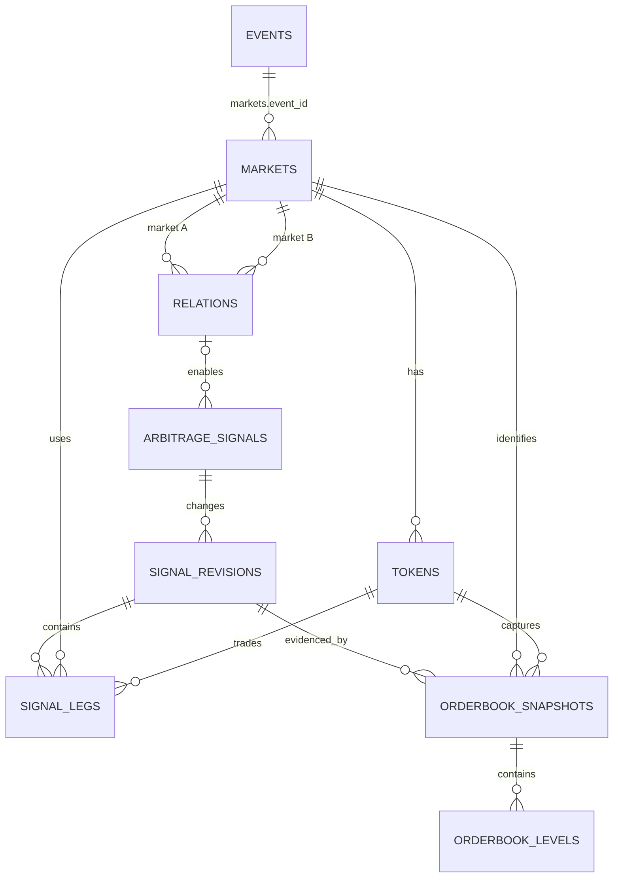

# 市场同步、实时监控与套利信号系统 Greenfield 重构设计

**日期：** 2026-07-31
**状态：** 等待书面规格审阅
**目标 Schema 版本：** 1

## 1. 目标

从零重构 `predmarket`，建立一个只读的 Polymarket 套利研究与信号系统：

1. `sync-market` 持续同步活跃事件、市场、token、市场状态和平台提供的 NegRisk 元数据。
2. `sync-market` 在数据库提交成功后，通过进程内事件队列主动通知 `watch` 新增、更新或停止监控市场。
3. `watch` 使用官方 Polymarket Python SDK 维护实时订单簿，在内部直接调用 strategy。
4. strategy 支持二元低估完整集、二元高估完整集、人工批准的逻辑蕴含关系和 SDK 权威 NegRisk 完整集。
5. 达到收益与风险门槛时，生成具有 `OPEN -> UPDATED -> CLOSED` 生命周期的套利信号。
6. 数据库只保存当前市场知识、逻辑关系状态、套利信号及信号证据，不保存全量 WebSocket 消息或普通 rejected 分析。

本阶段只验证机会发现和风险模型，不认证、不连接钱包、不签名、不下单，也不执行链上 `MERGE`、`SPLIT`、`REDEEM` 或 NegRisk 转换。

## 2. 已确认的设计决策

- 采用模块化单体：单进程、单 asyncio event loop、多个长期 task。
- 使用官方 [`Polymarket/py-sdk`](https://github.com/Polymarket/py-sdk) 发布的 `polymarket-client`。
- 初始实现固定 `polymarket-client==0.3.0b1`，并将项目最低 Python 版本提升到 3.11。
- 所有外部访问封装在 `PolymarketGateway`，业务代码不直接拼接 API 或 WebSocket 请求。
- 固定 SDK 版本；升级必须经过适配器测试。
- `sync-market` 是市场元数据的唯一写入者。
- `sync-market` 与 `watch` 之间使用有界 `MarketChangeQueue`。
- `watch` 内部直接调用 strategy，不设置 `OrderBookUpdateQueue`。
- 队列满时通知并进入 `DEGRADED`，程序继续运行。
- `watch` task 异常退出时通知并终止整个进程。
- 不自动补偿队列中丢失的变更；重启程序后通过初始同步恢复。
- 不永久保存全量订单簿事件，只保存产生信号时使用的完整盘口证据。
- 普通未满足策略的分析只计入内存聚合指标。
- `risk_rate = worst_case_loss / total_capital`。
- 逻辑关系只表达 `market A => market B`，按 `NO_LLM_APPROVE -> LLM_APPROVE -> APPROVED` 转换；只有 `APPROVED` 可参与策略。
- 人工审批不保存审批人、审批时间、结论或依据版本。
- SDK 提供且校验完整的 NegRisk event/market 元数据直接驱动 NegRisk strategy，不写入逻辑关系表。
- 旧数据库不迁移。
- 实施时删除旧业务代码、旧测试和旧数据库，按本设计重新创建。

## 3. 非目标

- 自动交易、钱包管理、签名、下单和撤单。
- 真实成交概率预测。
- 把 `risk_rate` 解释为亏损概率。
- 保存每条行情或每次 rejected evaluation。
- 引入 Redis、Kafka、PostgreSQL 或微服务部署。
- 兼容旧 schema v7 或旧数据库内容。
- LLM 自动批准或激活逻辑关系。

## 4. 总体架构



## 5. 组件边界

### 5.1 Supervisor

- 创建数据库、SDK gateway、队列和长期 task。
- 执行受控启动和关闭。
- 监控 `SyncMarketTask` 和 `WatchTask`。
- 核心 task 未预期退出时通知并终止进程。
- 维护进程级 `HEALTHY` 或 `DEGRADED` 状态。

### 5.2 PolymarketGateway

- 唯一允许导入 `polymarket-client` 的模块。
- 仅初始化 `AsyncPublicClient`。
- 提供稳定内部接口：

```text
list_active_events()
list_active_markets()
get_order_books(token_ids)
subscribe_markets(token_ids)
refresh_market(market_id)
close()
```

- 将 SDK model 转换为内部 domain model。
- 隔离 SDK 版本变化。
- 不暴露认证、钱包或交易 client。

SDK 0.3.0b1 已提供事件/市场分页、订单簿查询和公开 market stream。SDK 仍处于 beta；升级版本必须显式修改依赖锁文件，并通过 gateway contract tests 和 live read-only smoke test。

固定版本的公开订阅句柄不暴露透明重连、断线或丢包生命周期。为满足
generation fail-closed，`predmarket/polymarket/gateway.py` 可以读取该固定
版本中最小必要的私有连接状态，但必须集中封装并由版本、属性结构和状态转换
合同测试锁定。私有结构缺失、改变或产生未知状态时必须立即使 generation
失效并停止 watch，禁止静默继续；仍禁止绕过 SDK 直接访问 HTTP/WebSocket。

### 5.3 SyncMarketTask

- 持续同步事件、市场、token 和 event-market 关系。
- 同步 SDK 权威 NegRisk event/market 元数据。
- 每轮全量同步拥有唯一 `sync_generation`；只有所有分页、实体解析和事务提交全部成功，才把该 generation 标记为完整。
- 只有完整 generation 才能执行 missing/deactivation diff；不完整 generation 保留所有旧实体状态，不发布停用或结算事件。
- 发现本地逻辑关系候选。
- 比较同步前后的状态，生成 `MarketChange`。
- 必须先提交数据库事务，再发布变更。

### 5.4 RelationDetector

- 只发现 `market A => market B` 逻辑关系。
- 输入是已规范化的 event、market 和 token。
- 初始写入状态为 `NO_LLM_APPROVE`。
- 可选 LLM 分析器把状态推进为 `LLM_APPROVE`。
- 人工确认把状态推进为 `APPROVED`。

### 5.5 WatchTask

- 启动时加载所有当前可监控市场。
- 通过 SDK 订阅对应 token 的实时订单簿。
- 消费 `MarketChangeQueue` 并动态增减订阅。
- 在内存中维护 `OrderBookCache`。
- 每次有效盘口变化后直接调用 `StrategyEngine`。
- 市场停用、结算或盘口失效时关闭相关信号。
- 每次订阅使用递增的 `subscription_generation`；断线、乱序或检测到增量缺口时立即使该 generation 的缓存失效。
- 失效后先关闭相关信号，再通过 SDK 获取完整 REST 订单簿；只有快照校验通过并建立新 generation 后才恢复策略计算。

### 5.6 RelationChangeMonitor

- 监听持久化在 `system_events` 中的 relation change log。
- 启动时在同一个 SQLite read transaction 中读取全部 `APPROVED` 关系和当前最大 `system_events.id`。
- 运行中增量读取更大 ID 的 `RELATION_ACTIVATED` 事件。
- 将关系激活通知交给同一进程的 WatchTask。
- 独立 CLI 不直接访问运行进程内的 `MarketChangeQueue`。

### 5.7 StrategyEngine

- 纯计算模块。
- 不访问 SDK、数据库或通知系统。
- 输入不可变 `StrategyContext`。
- 只输出 `OpportunityPresent`、`OpportunityAbsent` 或 `NotEvaluable`。
- 根据变更 token 只运行受影响策略。

### 5.8 SignalManager

- 维护信号 `OPEN -> UPDATED -> CLOSED` 生命周期。
- 结合 Strategy 结果和当前 OPEN signal 决定 `OPENED`、`UPDATED`、`CLOSED` 或不写库。
- 判断变化是否达到落库阈值。
- 在一个事务内保存 revision、market 关联、legs 和订单簿证据。
- 提交前重新读取并验证 market、relation、订单簿 generation 和 `latest_revision`。
- 数据库提交成功后才通知。

### 5.9 DatabaseWriter

- 运行进程内唯一数据库写入 actor；SyncMarketTask、WatchTask、SignalManager、RelationChangeMonitor 和 Notifier 通过命令队列提交写请求。
- 每个写命令在一个短事务内执行，禁止业务 task 各自持有 SQLite 写连接。
- SignalManager 使用 `latest_revision` compare-and-swap；revision 插入、signal 主表更新、legs 和订单簿证据必须原子提交。
- 独立 relation CLI 是单独进程，不经过内存 actor；它使用 SQLite busy timeout、有界重试和短事务。WAL 只允许其与主进程 writer 串行争用，不改变单进程单 writer 原则。

## 6. 运行时数据流

### 6.1 启动

```text
1. 初始化全新 schema v1
2. 运行 foreign key、JSON 引用和 canonical 编码 integrity checks
3. 创建 AsyncPublicClient gateway
4. SyncMarketTask 完成首次完整全量同步
5. WatchTask 从数据库加载当前活跃市场
6. WatchTask 获取初始完整订单簿并建立订阅 generation
7. 开始持续同步、动态变更和策略分析
```

### 6.2 市场同步与动态订阅



### 6.3 订单簿与策略



## 7. MarketChangeQueue

事件类型：

```text
MARKET_ADDED
MARKET_UPDATED
MARKET_DEACTIVATED
EVENT_SETTLED
```

消息至少包含：

```text
change_id
change_type
event_id
market_id
token_ids
occurred_at
```

队列满时：

1. 只有 `MARKET_ADDED` 和非关键 `MARKET_UPDATED` 可以被丢弃。
2. `MARKET_DEACTIVATED` 和 `EVENT_SETTLED` 不得丢弃；队列满时先淘汰最旧的可丢弃事件再入队。
3. 如果队列中全部是不可丢弃事件，SyncMarketTask 等待 WatchTask 释放容量，程序不终止。
4. 写错误日志和 `system_events`。
5. 通知用户。
6. 系统状态永久标为 `DEGRADED`，直到程序重启。
7. 进程继续运行，Watch 保持已有市场及所有停用/结算控制事件的正确处理。

进入 `DEGRADED` 后，不再声称覆盖队列溢出期间新增或更新的全部市场；已监听市场继续运行。

## 8. 市场有效性

市场只有同时满足以下条件才进入 watch：

```text
status = ACTIVE
active = true
accepting_orders = true
enable_orderbook = true
resolved_at IS NULL
```

满足以下任一条件时停止分析：

```text
status != ACTIVE
active = false
accepting_orders = false
enable_orderbook = false
resolved_at IS NOT NULL
SDK 不再将已经到期的市场列为活跃
```

停止顺序：

```text
更新数据库
-> 发布 MARKET_DEACTIVATED 或 EVENT_SETTLED
-> watch 取消订阅
-> 清除 OrderBookCache
-> 关闭相关 OPEN 信号
```

### 8.1 完整同步批次

每轮全量同步先生成 `sync_generation`，并追踪：

```text
所有分页是否到达正常终点
每页请求是否成功
每个必需实体是否成功解析
event/market/token 数量及去重结果
数据库事务是否完整提交
```

只有全部条件满足才是完整 generation。只有完整 generation 可以：

- 将上一个完整 generation 中存在、当前缺失的实体判定为停用；
- 更新 `neg_risk_complete`；
- 发布 `MARKET_DEACTIVATED` 或 `EVENT_SETTLED`。

分页中断、单条必需实体解析失败或事务失败时，整轮标记为不完整：已成功解析实体允许幂等更新非删除式字段，但所有缺失实体保留原状态，不执行 missing diff，不产生停用/结算事件，并记录 `SYNC_GENERATION_INCOMPLETE`。

### 8.2 WebSocket cache barrier

每组订阅拥有单调递增的 `subscription_generation`。发生断线、乱序、重复序列无法消解、增量缺口或 book hash 校验失败时：

```text
标记该 generation 的 OrderBookCache 为 INVALID
-> Strategy 对受影响 token 返回 NotEvaluable
-> SignalManager 立即关闭相关 OPEN signal
-> CLOSED revision 不保存经济指标和伪造盘口证据
-> 通过 SDK 获取完整 REST order book
-> 校验 token、时间戳、价格/数量、排序和 book hash
-> 建立新的 subscription_generation
-> 丢弃旧 generation 的迟到消息
-> 接受新 generation 增量
-> 恢复 Strategy
```

恢复后若机会仍成立，创建新的 signal ID，不复用已经关闭的 signal。

## 9. `market A => market B` 关系、LLM 与审批

关系模型只表达有方向的市场逻辑蕴含：

```text
market A => market B
```

不使用通用 relation type、relation legs 或 NegRisk relation。

内置二元 YES/NO 完整集由单个 market/token 结构确定，不进入关系表。NegRisk 由 SDK 同步到 event/market 的权威元数据驱动，也不进入关系表。

### 9.1 关系来源

- 同一 event 下市场标题、描述和结算语义的规则分析。
- 跨 event 市场的文本或规则分析。
- 人工创建。
- 将来的 LLM 分析。

发现关系时必须明确 `market_a_id` 和 `market_b_id`，初始状态固定为：

```text
NO_LLM_APPROVE
```

### 9.2 状态机



只允许上述正向转换，不允许跳级或回退。只有 `APPROVED` 关系可参与套利信号计算。

`NO_LLM_APPROVE` 的含义是尚未经过 LLM 分析，不表示 LLM 已否决。`LLM_APPROVE` 的含义是 LLM 建议成立，但尚未完成人工确认。

默认 `llm_enabled: false` 时，关系有意停留在 `NO_LLM_APPROVE`，A→B strategy 默认不可用。这是人工审查门禁，不是可用性故障。需要启用逻辑策略时，操作者必须配置 LLM analyzer、执行分析，再人工确认。

### 9.3 LLM 扩展接口

```text
RelationAnalyzer.analyze(market_a, market_b)
    -> LlmRelationDecision
```

输出：

```text
approved
confidence
reasoning
warnings
```

行为：

- `approved=true` 时可将状态从 `NO_LLM_APPROVE` 更新为 `LLM_APPROVE`。
- LLM 不得将关系更新为 `APPROVED`。
- LLM 判断不成立或调用失败时保持 `NO_LLM_APPROVE`。
- LLM 输出保存在同一 `relations.llm_analysis_json` 字段。
- 第一版允许只提供接口和 fake analyzer。

### 9.4 人工确认

```text
predmarket relations list
predmarket relations show RELATION_ID
predmarket relations analyze RELATION_ID
predmarket relations approve RELATION_ID
```

`analyze` 只在 `llm_enabled: true` 且 analyzer 配置完整时可执行，并且只允许：

```text
NO_LLM_APPROVE -> LLM_APPROVE
```

`approve` 只允许：

```text
LLM_APPROVE -> APPROVED
```

事务必须重新校验：

- `market_a_id` 和 `market_b_id` 均存在且不同；
- 两个市场的结算语义仍适合逻辑蕴含；
- 当前状态为 `LLM_APPROVE`。

审批事务必须同时：

1. 更新 `relations.status = APPROVED`。
2. 向 `system_events` 追加 `RELATION_ACTIVATED`，`details_json` 至少包含 `relation_id`。
3. 原子提交。

运行进程的 `RelationChangeMonitor` 监听该持久化 change log，使下一次相关盘口变化可以触发逻辑策略。独立 CLI 不尝试写入进程内队列。

不保存审核人、审批时间、审核结论或依据版本。

`APPROVED` 是不可撤销终态。本阶段明确不提供停用、撤销或回退路径；如果关系误批，操作者必须停止程序、修正数据库或重建环境后再运行。这是已接受的验证阶段限制。

### 9.5 SDK 权威 NegRisk

NegRisk strategy 直接读取：

- `events.neg_risk` 和 `events.neg_risk_id`；
- `events.neg_risk_type`、`events.neg_risk_complete`、`events.neg_risk_conversion_supported`；
- `events.neg_risk_metadata_json` 中由 gateway 从当前固定 SDK 显式映射的权威转换参数；
- `events.market_ids_json`；
- 每个成员 `markets.neg_risk`、`markets.neg_risk_outcome_position` 和 `markets.neg_risk_member_complete`；
- market、condition 和 token 映射。

只有以下 eligibility predicate 全部为真时才运行策略：

```text
event.neg_risk = true
event.neg_risk_id IS NOT NULL
event.neg_risk_type IN supported_neg_risk_types
event.neg_risk_complete = true
event.neg_risk_conversion_supported = true
event、market、token 来自同一个 sync_generation 且各自 sync_generation_complete = true
event.market_ids_json 与数据库成员集合完全一致
所有成员 market.neg_risk = true
所有成员 outcome position 唯一、连续且集合互斥穷尽
每个成员的 condition/token 映射完整
所有动作所需 fee schedule 已知且未过期
```

`neg_risk_type` 和 `neg_risk_metadata_json` 只能由 `PolymarketGateway` 从固定 SDK 的明确字段映射，禁止根据标题或描述猜测。SDK 未提供某个证明条件时，对应完整性字段必须为 false。任一条件缺失返回 `NotEvaluable`，不创建关系记录或本地推断关系。

## 10. Strategy 设计

统一接口：

```text
evaluate(context: StrategyContext) -> StrategyDecision
```

统一输入：

```text
strategy_type
changed_token_id
markets
tokens
approved_implication_relation
orderbooks
fee_schedules
evaluated_at
configuration
```

统一输出：

```text
OpportunityPresent
OpportunityAbsent
NotEvaluable
```

- `OpportunityPresent`：包含当前真实计算、动作腿和订单簿证据。
- `OpportunityAbsent`：输入完整且有效，但确定不满足收益、风险、深度或数量门槛；包含关闭时的真实计算和证据。
- `NotEvaluable`：缺少必要元数据、费用、有效订单簿或同步完整性，不能对机会是否存在作出结论；包含稳定的 `reason_code` 和上下文，不伪造经济指标。

Strategy 不读取当前 signal，也不决定 OPEN、UPDATE 或 CLOSE。SignalManager 根据当前 OPEN signal 和上述结果执行：

| 当前状态 | Strategy 结果 | SignalManager 行为 |
|---|---|---|
| 无 OPEN signal | `OpportunityPresent` | 创建 signal 和 `OPENED` revision |
| 有 OPEN signal | `OpportunityPresent` 且显著变化 | 追加 `UPDATED` revision |
| 有 OPEN signal | `OpportunityPresent` 但变化不显著 | 不写库 |
| 有 OPEN signal | `OpportunityAbsent` | 追加带当前真实指标的 `CLOSED` revision |
| 有 OPEN signal | `NotEvaluable` | 追加不带当前经济指标的 `CLOSED` revision |
| 无 OPEN signal | `OpportunityAbsent/NotEvaluable` | 不创建 signal，只增加内存指标 |

### 10.1 二元低估完整集

动作：

```text
BUY YES -> BUY NO -> MERGE
```

计算：

```text
total_capital =
    yes_buy_cost
  + no_buy_cost
  + trading_fees
  + conversion_cost
  + safety_buffer

minimum_proceeds = quantity
expected_profit = minimum_proceeds - total_capital
return_rate = expected_profit / total_capital
```

### 10.2 二元高估完整集

动作：

```text
SPLIT -> SELL YES -> SELL NO
```

计算：

```text
total_capital =
    split_collateral
  + conversion_cost
  + safety_buffer

expected_profit =
    yes_net_sale_proceeds
  + no_net_sale_proceeds
  - total_capital
```

### 10.3 逻辑蕴含

只有状态为 `APPROVED` 的 `market A => market B` relation 可用。

对 `A => B`：

```text
BUY NO_A -> BUY YES_B -> REDEEM
```

允许状态的最低支付为一单位：

```text
A=false, B=false -> NO_A = 1
A=false, B=true  -> NO_A + YES_B = 2
A=true,  B=true  -> YES_B = 1
```

该策略：

```text
execution_mode = HOLD_TO_RESOLUTION
```

### 10.4 NegRisk 完整集

只使用 SDK 权威的 NegRisk event/market 元数据，不读取 `relations`。

第一版支持：

```text
BUY required outcomes
-> NEG_RISK_CONVERT 或 REDEEM
```

如果结果集合、转换语义、完整同步证明或费用不完整，返回 `NotEvaluable`。

### 10.5 数量优化

- 按完整 L2 深度计算。
- 候选数量来自盘口档位断点、最小订单量、最大本金和默认测试数量。
- 在所有满足限制的数量中选择 `expected_profit` 最大者。
- 不允许使用 `best_price * quantity` 代替深度模拟。

### 10.6 风险

每次产生信号必须计算：

```text
total_capital
expected_profit
return_rate
worst_case_loss
risk_rate
unhedged_notional
risk_flags
```

硬公式：

```text
risk_rate = worst_case_loss / total_capital
return_rate = expected_profit / total_capital
```

失败场景至少包括：

- 只成交第一腿；
- 只成交部分腿；
- 转换失败；
- 未完成腿按当前可立即平仓深度估值；
- 无法平仓部分按零估值。

信号门槛：

```text
expected_profit > 0
return_rate >= configured_minimum_return_rate
risk_rate <= configured_maximum_risk_rate
unhedged_notional <= configured_maximum_unhedged_notional
所有必需订单簿有效
```

## 11. 信号生命周期



机会身份：

```text
opportunity_key =
    strategy_type
  + relation_id 或排序后的 market/token 集合
  + direction
```

显著更新阈值：

```text
profit_change_rate
risk_rate_change
quantity_change_rate
minimum_update_interval_seconds
```

已关闭信号不重新打开；机会再次出现时创建新的 signal ID。

关闭分为两类：

1. `OpportunityAbsent`：订单簿和输入仍有效，可以证明机会跌破门槛。`CLOSED` revision 保存关闭时重新计算的真实指标、legs 和完整订单簿证据。
2. `NotEvaluable`：市场关闭/结算、WebSocket 断线、增量缺口、订单簿失效、费用或元数据缺失。`CLOSED` revision 的经济指标为空，只保存 `closure_context_json`；不得复制上一 revision 的指标。

WebSocket 恢复不重新打开旧 signal。完整 REST 订单簿通过校验并建立新 `subscription_generation` 后，Strategy 重新计算；若机会成立，创建新的 signal。

## 12. 数据库原则

- SQLite、WAL、foreign keys。
- 全新 schema v1。
- 不迁移或读取 schema v7。
- 当前表是当前事实，不再额外维护 catalog snapshot/current 双套模型。
- 不保存同一事实的 canonical JSON 副本。
- JSON 只用于形状不稳定且不承担关系约束的数据。
- 金额、价格、比率和数量使用规范 decimal 字符串。
- 时间统一使用 UTC Unix 毫秒整数。
- 标量关联使用真实外键；按已确认设计，event 和 signal 的 market ID 数组是显式例外。
- 关键业务身份使用唯一约束。
- signal revision、markets、legs 和 orderbook evidence 在同一事务写入。
- 运行进程内所有写入通过 `DatabaseWriter` 串行执行；CLI 只允许短事务并配置 busy timeout。

Decimal 规范编码：

```text
只允许普通十进制定点形式：-?[0-9]+(\.[0-9]+)?
禁止 NaN、Infinity、指数形式、前导加号和负零
整数不保留前导零；小数去除无意义尾零和末尾小数点
零统一编码为 "0"
price、tick_size、fee rate 必须在各自定义范围内
quantity、size、total_capital 必须 > 0
```

所有 Decimal 由单一 domain serializer 编码，并在 repository 写入前验证；数据库 CHECK 负责非空和基础范围，精确 Decimal 语法及跨字段公式由 domain/repository 验证。

JSON 数组统一使用 canonical serializer：元素必须是非空 string，去重后按规范化 ID 的 UTF-8 字节升序排列，输出无多余空白。数据库使用 `json_valid(...) AND json_type(...) = 'array'` 检查形状；repository 和启动 integrity query 负责非空、类型、重复、排序、悬空 ID 及双写一致性。

## 13. Schema v1 总览

Schema 共 10 张项目表：

### 市场知识库

1. `events`
2. `markets`
3. `tokens`

### 关系

4. `relations`

### 信号与证据

5. `arbitrage_signals`
6. `signal_revisions`
7. `signal_legs`
8. `orderbook_snapshots`
9. `orderbook_levels`

### 运行审计

10. `system_events`

SQLite 内部表不计入项目表数量。



`events.market_ids_json` 和 `arbitrage_signals.market_ids_json` 是数组字段，Mermaid ER 无法表达其中的逐项引用；应用层负责验证其内容。

## 14. 字段级数据字典

### 14.1 `events`

**含义：** Polymarket 预测事件的当前状态。
**写入者：** `SyncMarketTask`。
**读取者：** watch、relation detector、strategy、CLI。

| 字段 | 类型与约束 | 含义 |
|---|---|---|
| `id` | `TEXT PRIMARY KEY` | SDK event ID |
| `slug` | `TEXT UNIQUE`，可空 | event slug |
| `title` | `TEXT NOT NULL` | 事件标题 |
| `description` | `TEXT`，可空 | 事件描述或规则摘要 |
| `status` | `TEXT NOT NULL CHECK` | `ACTIVE/CLOSED/RESOLVED/ARCHIVED` |
| `neg_risk` | `INTEGER NOT NULL CHECK IN (0,1)` | 是否为 SDK 标识的 NegRisk event |
| `neg_risk_id` | `TEXT`，可空 | SDK 提供的 NegRisk 标识 |
| `neg_risk_type` | `TEXT`，可空 | gateway 从 SDK 规范化的权威 NegRisk 类型；必须属于配置的支持集合 |
| `neg_risk_complete` | `INTEGER NOT NULL CHECK IN (0,1)` | 完整 sync generation 是否证明成员集合互斥且穷尽 |
| `neg_risk_conversion_supported` | `INTEGER NOT NULL CHECK IN (0,1)` | 固定 SDK 是否提供并支持所需转换语义 |
| `neg_risk_metadata_json` | `TEXT`，可空且必须为 JSON object | SDK 权威转换参数及 gateway 映射版本，不保存推测字段 |
| `neg_risk_synced_at` | `INTEGER`，可空 | 最近一次完整 NegRisk 同步时间 |
| `market_ids_json` | `TEXT NOT NULL CHECK(json_valid(...) AND json_type(...)='array')` | canonical market ID 非空数组 |
| `sync_generation` | `TEXT NOT NULL` | 最近一次成功解析该实体的同步 generation |
| `sync_generation_complete` | `INTEGER NOT NULL CHECK IN (0,1)` | 该 generation 是否完整结束 |
| `start_at` | `INTEGER`，可空 | 开始时间 |
| `end_at` | `INTEGER`，可空 | 预计结束时间 |
| `resolved_at` | `INTEGER`，可空 | 结算时间 |
| `source_updated_at` | `INTEGER`，可空 | 上游更新时间 |
| `created_at` | `INTEGER NOT NULL` | 本地首次发现时间 |
| `updated_at` | `INTEGER NOT NULL` | 本地最后更新时间 |

### 14.2 `markets`

**含义：** 可交易的具体预测问题。
**写入者：** `SyncMarketTask`。
**读取者：** watch、strategy、relations、signals。

| 字段 | 类型与约束 | 含义 |
|---|---|---|
| `id` | `TEXT PRIMARY KEY` | SDK market ID |
| `event_id` | `TEXT NOT NULL FK events(id)` | 所属 event |
| `condition_id` | `TEXT NOT NULL UNIQUE` | CTF condition ID |
| `slug` | `TEXT UNIQUE`，可空 | market slug |
| `question` | `TEXT NOT NULL` | 市场问题 |
| `description` | `TEXT`，可空 | 市场描述或规则摘要 |
| `status` | `TEXT NOT NULL CHECK` | `ACTIVE/CLOSED/RESOLVED/ARCHIVED` |
| `active` | `INTEGER NOT NULL CHECK` | SDK active 状态 |
| `accepting_orders` | `INTEGER NOT NULL CHECK` | 是否接受订单 |
| `enable_orderbook` | `INTEGER NOT NULL CHECK` | 是否启用订单簿 |
| `neg_risk` | `INTEGER NOT NULL CHECK` | 是否属于 NegRisk |
| `neg_risk_outcome_position` | `INTEGER`，可空且 `>= 0` | SDK 权威 NegRisk 成员顺序 |
| `neg_risk_member_complete` | `INTEGER NOT NULL CHECK IN (0,1)` | 该成员 condition/token/outcome 映射是否完整 |
| `sync_generation` | `TEXT NOT NULL` | 最近一次成功解析该实体的同步 generation |
| `sync_generation_complete` | `INTEGER NOT NULL CHECK IN (0,1)` | 该 generation 是否完整结束 |
| `tick_size` | `TEXT`，可空 | 当前最小价格步长 |
| `minimum_order_size` | `TEXT`，可空 | 当前最小订单量 |
| `end_at` | `INTEGER`，可空 | 预计结束时间 |
| `resolved_at` | `INTEGER`，可空 | 结算时间 |
| `source_updated_at` | `INTEGER`，可空 | 上游更新时间 |
| `created_at` | `INTEGER NOT NULL` | 本地首次发现时间 |
| `updated_at` | `INTEGER NOT NULL` | 本地最后更新时间 |

布尔字段均约束为 `0/1`。

`markets.event_id` 是 event-market 关系的规范事实。`events.market_ids_json` 是按用户要求保留的反规范化读取字段。`SyncMarketTask` 必须在同一事务内更新两者，并在提交前验证数组恰好等于：

```sql
SELECT id FROM markets WHERE event_id = ? ORDER BY CAST(id AS BLOB)
```

### 14.3 `tokens`

**含义：** market 的可交易 outcome token。
**写入者：** `SyncMarketTask`。

| 字段 | 类型与约束 | 含义 |
|---|---|---|
| `id` | `TEXT PRIMARY KEY` | CLOB token ID |
| `market_id` | `TEXT NOT NULL FK markets(id)` | 所属 market |
| `outcome` | `TEXT NOT NULL` | `YES/NO` 或其他 outcome 名称 |
| `position` | `INTEGER NOT NULL CHECK >= 0` | outcome 顺序 |
| `fee_schedule_json` | `TEXT`，可空且必须为 JSON object | gateway 规范化的权威费用模式、参数、启用状态及来源 |
| `fee_updated_at` | `INTEGER`，可空 | 费率更新时间 |
| `sync_generation` | `TEXT NOT NULL` | 最近一次成功解析该实体的同步 generation |
| `sync_generation_complete` | `INTEGER NOT NULL CHECK IN (0,1)` | 该 generation 是否完整结束 |
| `created_at` | `INTEGER NOT NULL` | 本地首次发现时间 |
| `updated_at` | `INTEGER NOT NULL` | 本地最后更新时间 |

唯一约束：

```text
(market_id, position)
(market_id, outcome)
UNIQUE(market_id, id)
```

`fee_schedule_json` 至少包含稳定的 `model`、全部计算参数、`enabled` 和 `source`。Strategy 只调用统一 `FeeCalculator`；未知模式、缺参数或过期费用返回 `NotEvaluable`，禁止退化为零费用。

### 14.4 `relations`

**含义：** 单一表保存 `market A => market B` 从发现、LLM 判断到人工确认的全过程。
**写入者：** RelationDetector、RelationAnalyzer、人工确认服务。
**读取者：** 逻辑蕴含 strategy、CLI。

| 字段 | 类型与约束 | 含义 |
|---|---|---|
| `id` | `TEXT PRIMARY KEY` | relation ID |
| `market_a_id` | `TEXT NOT NULL FK markets(id)` | 蕴含前件 market A |
| `market_b_id` | `TEXT NOT NULL FK markets(id)` | 蕴含后件 market B |
| `status` | `TEXT NOT NULL CHECK` | `NO_LLM_APPROVE/LLM_APPROVE/APPROVED` |
| `discovery_source` | `TEXT NOT NULL CHECK` | `RULE/MANUAL` |
| `llm_confidence` | `TEXT`，可空 | LLM 置信度，仅供参考 |
| `llm_analysis_json` | `TEXT`，可空且必须为合法 JSON | LLM reasoning 和 warnings |
| `created_at` | `INTEGER NOT NULL` | 首次发现时间 |
| `updated_at` | `INTEGER NOT NULL` | 最后状态或分析更新时间 |

约束：

```text
market_a_id <> market_b_id
UNIQUE(market_a_id, market_b_id)
NO_LLM_APPROVE -> LLM_APPROVE -> APPROVED
```

只有 `APPROVED` 可参与策略。NegRisk 不写入此表。

### 14.5 `arbitrage_signals`

**含义：** 一次连续套利机会的生命周期。
**写入者：** SignalManager。

| 字段 | 类型与约束 | 含义 |
|---|---|---|
| `id` | `TEXT PRIMARY KEY` | signal ID |
| `opportunity_key` | `TEXT NOT NULL` | 策略、市场集合和方向构成的身份 |
| `strategy_type` | `TEXT NOT NULL CHECK` | `BINARY_UNDERPRICED/BINARY_OVERPRICED/LOGICAL_IMPLICATION/NEG_RISK_COMPLETE_SET` |
| `market_ids_json` | `TEXT NOT NULL CHECK(json_valid(...) AND json_type(...)='array')` | canonical market ID 非空数组 |
| `relation_id` | `TEXT FK`，可空 | 仅逻辑蕴含信号引用 relation；二元和 NegRisk 为空 |
| `execution_mode` | `TEXT NOT NULL CHECK` | `IMMEDIATE_CONVERSION/HOLD_TO_RESOLUTION` |
| `status` | `TEXT NOT NULL CHECK` | `OPEN/CLOSED` |
| `opened_at` | `INTEGER NOT NULL` | 首次满足门槛时间 |
| `updated_at` | `INTEGER NOT NULL` | 最后 revision 时间 |
| `closed_at` | `INTEGER`，可空 | 关闭时间 |
| `close_reason` | `TEXT`，可空 | 关闭原因 |
| `latest_revision` | `INTEGER NOT NULL CHECK >= 1` | 当前最新 revision 编号 |

约束：

```text
OPEN   -> closed_at IS NULL AND close_reason IS NULL
CLOSED -> closed_at IS NOT NULL AND close_reason IS NOT NULL
```

`close_reason` 使用稳定枚举：

```text
PROFIT_BELOW_THRESHOLD
RISK_ABOVE_THRESHOLD
INSUFFICIENT_DEPTH
QUANTITY_BELOW_MINIMUM
INSUFFICIENT_CAPITAL
MARKET_CLOSED
EVENT_SETTLED
ORDERBOOK_INVALID
ORDERBOOK_STALE
LEG_SKEW_EXCEEDED
SDK_DISCONNECTED
INPUT_METADATA_MISSING
FEE_SCHEDULE_UNKNOWN
FEE_SCHEDULE_STALE
SYNC_GENERATION_INCOMPLETE
RELATION_NOT_APPROVED
```

部分唯一索引：

```sql
CREATE UNIQUE INDEX one_open_signal_per_opportunity
ON arbitrage_signals(opportunity_key)
WHERE status = 'OPEN';
```

`market_ids_json` 必须是去重、按 market ID 排序的非空 JSON 数组。SignalManager 写入前逐个确认 market 存在。按 market 查询使用 SQLite `json_each(arbitrage_signals.market_ids_json)`。

合法组合：

```text
LOGICAL_IMPLICATION -> relation_id NOT NULL AND execution_mode = HOLD_TO_RESOLUTION
BINARY_UNDERPRICED  -> relation_id IS NULL AND execution_mode = IMMEDIATE_CONVERSION
BINARY_OVERPRICED   -> relation_id IS NULL AND execution_mode = IMMEDIATE_CONVERSION
NEG_RISK_COMPLETE_SET -> relation_id IS NULL AND execution_mode = IMMEDIATE_CONVERSION
```

### 14.6 `signal_revisions`

**含义：** signal 每次 OPEN、显著 UPDATE 或 CLOSE 的不可变计算版本。
**写入者：** SignalManager。

| 字段 | 类型与约束 | 含义 |
|---|---|---|
| `signal_id` | `TEXT NOT NULL FK` | 所属 signal |
| `revision` | `INTEGER NOT NULL CHECK >= 1` | 单 signal 递增版本 |
| `event_type` | `TEXT NOT NULL CHECK` | `OPENED/UPDATED/CLOSED` |
| `observed_at` | `INTEGER NOT NULL` | 计算时间 |
| `quantity` | `TEXT`，可空 | 优化后的可执行数量 |
| `total_capital` | `TEXT`，可空 | 总资金占用 |
| `expected_profit` | `TEXT`，可空 | 预计净利润 |
| `return_rate` | `TEXT`，可空 | `expected_profit / total_capital` |
| `worst_case_loss` | `TEXT`，可空 | 枚举失败场景中的最大损失 |
| `risk_rate` | `TEXT`，可空 | `worst_case_loss / total_capital` |
| `unhedged_notional` | `TEXT`，可空 | 最大未对冲名义金额 |
| `risk_flags_json` | `TEXT NOT NULL` | 非固定数量的风险标志数组 |
| `calculation_json` | `TEXT`，可空且必须为 JSON object | 策略特有计算明细，不复制实体 |
| `closure_context_json` | `TEXT`，可空且必须为 JSON object | CLOSED 原因、不可计算字段和最后有效 revision 引用 |

主键：`(signal_id, revision)`。
revision 只允许追加，不允许更新或删除。约束：

```text
OPENED/UPDATED:
  全部经济字段和 calculation_json 非空
  closure_context_json IS NULL

CLOSED + OpportunityAbsent:
  全部经济字段和 calculation_json 非空
  保存关闭时 legs 和订单簿证据

CLOSED + NotEvaluable:
  全部经济字段和 calculation_json IS NULL
  closure_context_json 非空
  不写 signal_legs 或 orderbook_snapshots
```

`closure_context_json` 至少包含稳定 `reason_code`、受影响 market/token、`last_valid_revision` 和输入失效时间。历史指标只通过 `last_valid_revision` 引用，不复制为当前指标。

SignalManager 提交 revision 前，在同一写事务中重新验证：

```text
所有 market 仍可监控
逻辑策略 relation 仍为 APPROVED
订单簿 subscription_generation 仍等于 StrategyContext 使用的 generation
arbitrage_signals.latest_revision 等于计算开始时读取的 expected revision
```

更新使用 CAS：

```sql
UPDATE arbitrage_signals
SET latest_revision = ?, updated_at = ?, status = ?, closed_at = ?, close_reason = ?
WHERE id = ? AND latest_revision = ? AND status = 'OPEN';
```

影响行数不是 1 时回滚整个事务，重新读取上下文后决策；不得留下孤立 revision、legs 或 evidence。

### 14.7 `signal_legs`

**含义：** 某 signal revision 的动作腿和经济结果。
**写入者：** SignalManager。

| 字段 | 类型与约束 | 含义 |
|---|---|---|
| `signal_id` | `TEXT NOT NULL` | 所属 signal |
| `revision` | `INTEGER NOT NULL` | 所属 revision |
| `position` | `INTEGER NOT NULL CHECK >= 0` | 动作顺序 |
| `market_id` | `TEXT NOT NULL FK` | 相关 market |
| `token_id` | `TEXT`，可空 | 交易 token；转换动作可为空 |
| `action` | `TEXT NOT NULL CHECK` | `BUY/SELL/MERGE/SPLIT/REDEEM/NEG_RISK_CONVERT` |
| `side` | `TEXT CHECK`，可空 | `BUY/SELL`，转换动作为空 |
| `quantity` | `TEXT NOT NULL` | 动作数量 |
| `average_price` | `TEXT`，可空 | 深度成交平均价 |
| `worst_price` | `TEXT`，可空 | 最差成交价 |
| `gross_amount` | `TEXT NOT NULL` | 动作总金额 |
| `fee_amount` | `TEXT NOT NULL` | 动作费用 |

主键：`(signal_id, revision, position)`。
复合外键：`(signal_id, revision) -> signal_revisions`。

交易动作 `BUY/SELL` 必须同时具有非空 `token_id` 和匹配的 `side`；转换动作必须使 `token_id`、`side` 为空。非空 token 使用复合外键：

```sql
FOREIGN KEY (market_id, token_id)
  REFERENCES tokens(market_id, id)
```

### 14.8 `orderbook_snapshots`

**含义：** 某 signal revision 实际使用的完整订单簿元数据。
**写入者：** SignalManager。

| 字段 | 类型与约束 | 含义 |
|---|---|---|
| `id` | `TEXT PRIMARY KEY` | snapshot ID |
| `signal_id` | `TEXT NOT NULL` | 所属 signal |
| `revision` | `INTEGER NOT NULL` | 所属 revision |
| `market_id` | `TEXT NOT NULL FK` | 所属 market |
| `token_id` | `TEXT NOT NULL` | 所属 token |
| `subscription_generation` | `INTEGER NOT NULL CHECK >= 1` | 产生该证据的有效订阅 generation |
| `book_hash` | `TEXT NOT NULL` | 本地规范化盘口哈希 |
| `exchange_timestamp` | `INTEGER NOT NULL` | 上游行情时间 |
| `received_timestamp` | `INTEGER NOT NULL` | 本地接收 wall-clock 时间 |
| `tick_size` | `TEXT NOT NULL` | 使用的 tick size |
| `minimum_order_size` | `TEXT NOT NULL` | 使用的最小订单量 |

复合外键：`(signal_id, revision) -> signal_revisions`。
复合外键：`(market_id, token_id) -> tokens(market_id, id)`。
唯一约束：`(signal_id, revision, token_id)`。

### 14.9 `orderbook_levels`

**含义：** 信号证据订单簿的完整 L2 深度。
**写入者：** SignalManager。

| 字段 | 类型与约束 | 含义 |
|---|---|---|
| `snapshot_id` | `TEXT NOT NULL FK` | 所属 snapshot |
| `side` | `TEXT NOT NULL CHECK` | `BID/ASK` |
| `position` | `INTEGER NOT NULL CHECK >= 0` | 该 side 内的价格顺序 |
| `price` | `TEXT NOT NULL` | 价格 |
| `size` | `TEXT NOT NULL` | 可用数量 |

主键：`(snapshot_id, side, position)`。
删除 snapshot 时级联删除。

### 14.10 `system_events`

**含义：** 关键运行状态和异常；不保存普通行情。
**写入者：** Supervisor、DatabaseWriter、sync、watch、SignalManager、Notifier。

| 字段 | 类型与约束 | 含义 |
|---|---|---|
| `id` | `INTEGER PRIMARY KEY AUTOINCREMENT` | event ID |
| `component` | `TEXT NOT NULL` | `SUPERVISOR/DATABASE/SYNC/WATCH/STRATEGY/SIGNAL/NOTIFIER` |
| `severity` | `TEXT NOT NULL CHECK` | `INFO/WARNING/ERROR/FATAL` |
| `event_type` | `TEXT NOT NULL` | 稳定机器可读事件类型 |
| `message` | `TEXT NOT NULL` | 简洁错误或状态描述 |
| `details_json` | `TEXT`，可空 | 非固定结构上下文 |
| `occurred_at` | `INTEGER NOT NULL` | 发生时间 |

该表同时承担低频、持久化 relation change log。`RELATION_ACTIVATED` 必须与 relation 状态更新在同一事务提交，且不得被日志清理任务删除。

典型事件：

```text
QUEUE_FULL
WATCH_TASK_CRASHED
SYNC_TASK_CRASHED
SDK_DISCONNECTED
SUBSCRIPTION_FAILED
ORDERBOOK_GENERATION_INVALID
SYNC_GENERATION_INCOMPLETE
DATABASE_FAILURE
SYSTEM_DEGRADED
NOTIFICATION_FAILED
RELATION_ACTIVATED
```

### 14.11 启动与验收 integrity queries

除 `PRAGMA integrity_check` 和 `PRAGMA foreign_key_check` 外，必须查询并拒绝以下情况：

- `events.market_ids_json` 或 `arbitrage_signals.market_ids_json` 不是非空 array；
- `json_each` 元素不是非空 string、存在重复或不符合 UTF-8 字节升序；
- event 数组与 `SELECT id FROM markets WHERE event_id = ? ORDER BY CAST(id AS BLOB)` 不一致；
- signal 数组引用不存在的 market；
- `signal_legs` 或 `orderbook_snapshots` 的 token 不属于同一行的 market；
- Decimal 不是 canonical 编码、超出字段范围或不满足 `risk_rate = worst_case_loss / total_capital`；
- `latest_revision` 不等于该 signal 的最大 revision；
- revision 类型与经济字段、legs、evidence、closure context 的组合不合法。

启动检查失败时记录 `DATABASE_INTEGRITY_FAILURE`、通知并终止进程，不带病运行。

## 15. 索引

除主键和唯一索引外，至少创建：

```text
events(status)
markets(status, active, accepting_orders, enable_orderbook)
markets(event_id)
tokens(market_id)
relations(status)
relations(market_a_id)
relations(market_b_id)
arbitrage_signals(status, updated_at)
arbitrage_signals(relation_id)
signal_revisions(observed_at)
system_events(occurred_at)
system_events(severity, occurred_at)
```

## 16. 配置

```yaml
database:
  path: data/predmarket-v1.sqlite3
  busy_timeout_ms: 5000
  writer_queue_capacity: 1000

polymarket:
  sync_interval_seconds: 30
  request_timeout_seconds: 10
  reconnect_max_seconds: 60
  fee_schedule_max_age_seconds: 300

runtime:
  market_change_queue_capacity: 10000

strategy:
  bankroll: "1000"
  minimum_return_rate: "0.0075"
  maximum_risk_rate: "0.005"
  maximum_unhedged_notional: "20"
  safety_buffer_rate: "0.0025"
  conversion_cost: "0"
  maximum_book_age_ms: 1000
  maximum_leg_skew_ms: 250

signal:
  profit_change_rate: "0.05"
  risk_rate_change: "0.001"
  quantity_change_rate: "0.10"
  minimum_update_interval_seconds: 5

relations:
  llm_enabled: false

notification:
  terminal_enabled: true
  desktop_enabled: true
```

金额和比率必须写为 decimal 字符串。

项目运行时要求：

```text
Python >= 3.11
polymarket-client == 0.3.0b1
```

## 17. 代码结构

```text
predmarket/
├── app.py
├── cli.py
├── config.py
├── domain/
│   ├── market.py
│   ├── orderbook.py
│   ├── relation.py
│   ├── signal.py
│   ├── decimal.py
│   └── fees.py
├── polymarket/
│   └── gateway.py
├── catalog/
│   ├── sync.py
│   ├── repository.py
│   └── relation_detector.py
├── persistence/
│   ├── writer.py
│   └── integrity.py
├── watch/
│   ├── service.py
│   └── orderbook_cache.py
├── strategy/
│   ├── base.py
│   ├── dispatcher.py
│   ├── binary_complete_set.py
│   ├── logical_implication.py
│   ├── neg_risk.py
│   ├── depth.py
│   └── risk.py
├── signals/
│   ├── manager.py
│   ├── repository.py
│   └── notifier.py
├── relations/
│   ├── service.py
│   └── llm.py
└── storage/
    ├── database.py
    ├── schema.py
    └── migrations.py
```

依赖方向：

```text
domain <- catalog/watch/strategy/signals
gateway <- catalog/watch
repositories <- catalog/signals/relations
CLI -> application services
```

约束：

- domain 不依赖 SDK、SQLite 或 CLI。
- strategy 是纯计算。
- gateway 是唯一 SDK 边界。
- repository 是唯一 SQL 边界。
- 单个生产文件原则上不超过约 400 行。

## 18. CLI

```text
predmarket run
predmarket status
predmarket signals list
predmarket signals show SIGNAL_ID
predmarket relations list
predmarket relations show RELATION_ID
predmarket relations analyze RELATION_ID
predmarket relations approve RELATION_ID
```

`run` 同时启动 sync、watch、strategy 和 signal 管道。新系统不再提供彼此脱节的独立生产命令。

## 19. 故障处理

| 故障 | 行为 |
|---|---|
| SDK 短暂断线、超时或限流 | 立即使相关 order book generation 失效并关闭 OPEN signal；指数退避重连，超过阈值后通知 |
| 单条 SDK 数据不合法 | 当前 sync generation 标记为不完整；保留旧实体状态，不执行 missing/deactivation diff |
| 全量分页中断 | 当前 generation 标记为不完整；允许非删除式 upsert，禁止停用或结算推断 |
| `MarketChangeQueue` 满 | 只丢弃/淘汰新增或非关键更新；停用和结算事件必须等待入队；通知并进入 `DEGRADED` |
| Watch task 异常退出 | 通知并终止进程 |
| Sync task 异常退出 | 通知并终止进程 |
| Strategy 输入不完整或不合法 | 返回 `NotEvaluable`；若存在 OPEN signal 则关闭并保存 closure context |
| Strategy 未预期异常 | 通知，进入 `DEGRADED`，继续 watch |
| SQLite busy | 在配置时间内有界重试 |
| revision CAS 冲突 | 重新读取当前 signal 和 market/relation 状态后重新决策；超过重试上限则通知并终止进程 |
| SQLite 写入或完整性失败 | 通知并终止进程 |
| 通知失败 | 写 `system_events`，不改变 signal 状态 |
| WebSocket 断线、增量缺口或盘口失效 | cache 标记 INVALID；用无经济指标的 CLOSED revision 关闭相关 signal；完整 REST 快照和新 generation 建立前不运行策略 |

## 20. 测试

### 20.1 Domain

- market/event/token 不变量。
- `market A => market B` 关系状态机和市场绑定。
- signal 生命周期。
- Decimal canonical 编码、非法值、价格/费率范围、时间和 ID 边界。
- JSON canonical serializer 的类型、去重和 UTF-8 字节排序。

### 20.2 Strategy

四类策略分别覆盖：

- 正常套利。
- 无利润。
- 深度不足。
- fee 导致利润消失。
- stale book。
- 多腿时间偏差。
- 部分腿成交和转换失败。
- 本金限制。
- 收益率与风险率门槛。
- 数量优化。
- NegRisk 结果集合不完整。
- NegRisk 类型、转换字段、费用或 sync generation 缺失时返回 `NotEvaluable`。
- `OpportunityPresent/OpportunityAbsent/NotEvaluable` 不依赖当前 signal 状态。
- 未批准 relation 不可参与。

### 20.3 Catalog

- SDK model 到 domain model 的转换。
- event/market/token upsert，以及 `events.market_ids_json` 与 `markets.event_id` 一致性。
- 新增、更新、关闭和结算变更。
- 完整分页结束后才能执行 missing/deactivation diff。
- 半次分页、请求失败或实体解析失败保留旧状态，不发布停用事件。
- commit 后才发布 MarketChange。
- 事务失败不发布事件。
- SDK 权威 NegRisk 元数据可以直接驱动 NegRisk strategy。
- 不完整 NegRisk 元数据返回 `NotEvaluable`，不创建 relation。
- 默认关闭 LLM 时关系保持 `NO_LLM_APPROVE`，逻辑策略保持不可用。
- `relations analyze` 在启用 LLM 后推进至 `LLM_APPROVE`。
- LLM 只能执行 `NO_LLM_APPROVE -> LLM_APPROVE`。
- 人工确认只能执行 `LLM_APPROVE -> APPROVED`。
- 审批状态和 `RELATION_ACTIVATED` 在同一事务提交。
- RelationChangeMonitor 能让独立审批 CLI 的变更被运行进程发现。

### 20.4 Watch

- 初始订阅所有活跃 token。
- 动态新增和取消订阅。
- SDK 增量正确更新 OrderBookCache。
- WebSocket 断线、乱序和增量 gap 使当前 generation 失效。
- REST 完整 book 校验成功并建立新 generation 前不恢复策略。
- 旧 generation 的迟到消息不会污染新缓存。
- 市场失效关闭相关信号。
- watch 崩溃使 supervisor 终止进程。
- 队列满时只漏监控新增/非关键更新，停用和结算事件不得丢失。
- 队列溢出后进入 `DEGRADED` 但不退出，已有市场继续运行。

### 20.5 Signal

- 首次机会创建 OPEN。
- 显著变化追加 revision。
- 微小变化不落库。
- 机会消失关闭。
- `OpportunityAbsent` 关闭时保存当前真实指标、legs 和订单簿证据。
- `NotEvaluable` 关闭时经济字段为空，仅保存 closure context 和最后有效 revision 引用。
- WebSocket 断线关闭后恢复机会会创建新 signal ID。
- 再次出现创建新 signal。
- `arbitrage_signals.market_ids_json` 正确保存单 market、A/B 和 NegRisk market 集合。
- revision、legs 和 orderbook evidence 原子提交。
- sync 与 signal 并发写入由单 writer 串行化。
- signal 提交前重新验证 market/relation/orderbook generation。
- `latest_revision` CAS 冲突不会产生重复 revision 或不一致主表。
- DB 失败时不发送成功通知。

### 20.6 集成

使用 fake gateway 验证：

```text
新市场
-> sync 写数据库
-> MarketChangeQueue
-> watch 新增订阅
-> 盘口更新
-> strategy
-> OPEN signal
-> revision/market_ids_json/legs/books/levels
-> notification
```

以及：

```text
市场结算
-> sync 更新数据库
-> watch 取消订阅
-> OPEN signal CLOSED
```

故障集成场景：

```text
半次分页
-> generation incomplete
-> 保留旧 market ACTIVE
-> 不发布 MARKET_DEACTIVATED

WebSocket gap
-> cache INVALID
-> OPEN signal CLOSED without metrics
-> REST full book
-> new subscription_generation
-> 重新计算并按需创建新 signal

sync 停用与 signal 写竞争
-> DatabaseWriter 串行提交
-> SignalManager 提交前重校验失败
-> 不创建基于已停用市场的 OPEN signal
```

### 20.7 数据库

- schema 恰好包含 10 张项目表。
- `PRAGMA user_version = 1`。
- WAL 和 foreign keys 已启用。
- `PRAGMA integrity_check` 返回 `ok`。
- `PRAGMA foreign_key_check` 无记录。
- CHECK、唯一约束、级联和部分唯一索引按预期工作。
- `(market_id, token_id)` 复合外键拒绝跨 market token。
- integrity query 拒绝 JSON 非数组、空数组、非 string、重复、非 canonical 排序、悬空 ID 和 event 双写不一致。
- signal strategy、relation 和 execution mode 的组合 CHECK 按预期工作。

## 21. 验收标准

1. 所有市场元数据只由 `SyncMarketTask` 写入。
2. Watch 不独立发现市场，只消费初始同步结果和 sync 通知。
3. 所有 Polymarket 访问只经过固定版本 SDK gateway。
4. 系统只使用公开只读 client。
5. 四类策略拥有独立实现和测试。
6. 未批准逻辑关系不能产生信号。
7. 默认关闭 LLM 时逻辑关系不会进入 `APPROVED`，逻辑策略默认不可用。
8. 独立审批 CLI 通过持久化 relation change log 被运行进程发现。
9. 只有完整同步证明、受支持转换语义、完整成员集合和权威费用均满足时，SDK NegRisk 数据才可参与策略；否则返回 `NotEvaluable`。
10. 每条 signal 可查询全部 market、token、动作腿和盘口证据。
11. `risk_rate` 严格等于 `worst_case_loss / total_capital`。
12. 不永久保存全量 WS 消息或 rejected 分析。
13. signal 具备 OPEN、不可变 UPDATED revisions 和 CLOSED 生命周期；可计算关闭保存当前真实指标，不可计算关闭不复制历史指标。
14. 关键写入由单 writer、事务、CAS、外键、唯一约束和 CHECK 保护。
15. 队列满时通知并进入 `DEGRADED`，只允许漏掉新增或非关键更新。
16. `MARKET_DEACTIVATED` 和 `EVENT_SETTLED` 不得因队列满而丢失。
17. Watch 崩溃时通知并终止进程。
18. 不完整同步批次不能错误停用市场。
19. WebSocket 断线或增量 gap 会关闭相关信号，完整 REST 快照和新 generation 建立后才恢复策略。
20. JSON 数组、Decimal 编码和 token-market 复合引用通过完整性检查。
21. 完整测试和 SQLite 完整性检查通过。
22. README、运维文档、schema 和架构图与实现一致。

## 22. Greenfield 实施边界

实施计划可以删除：

- 当前 `predmarket/` 下旧业务实现；
- 当前 `tests/` 下旧测试；
- 当前配置指向的旧 SQLite 主文件及同名 `-wal`、`-shm`；
- 仅服务于旧架构且不再适用的脚本。

实施时必须保留：

- `.git` 和 Git 历史；
- 本规格文档；
- 与只读安全边界一致的项目级文档，随后按新架构重写；
- 用户未明确纳入范围的文件和改动。

删除前必须：

1. 确认没有运行中的 scanner/watch 进程。
2. 解析并打印旧数据库的精确绝对路径。
3. 仅删除该主文件及明确匹配的 `-wal/-shm`。
4. 不使用宽泛目录、环境变量或通配符作为删除目标。

## 23. 文档交付

实现完成后重写：

- `README.md`
- `docs/PROJECT-GUIDE.md`
- `docs/TUTORIAL.md`
- `docs/OPERATIONS.md`
- `docs/VERIFICATION.md`
- `SECURITY.md`
- `STRATEGY.md`

文档必须以 schema v1、10 张表和本规格中的模块边界为准。
